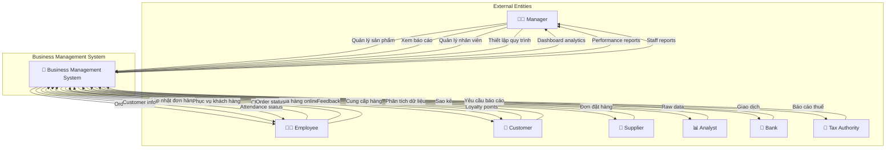
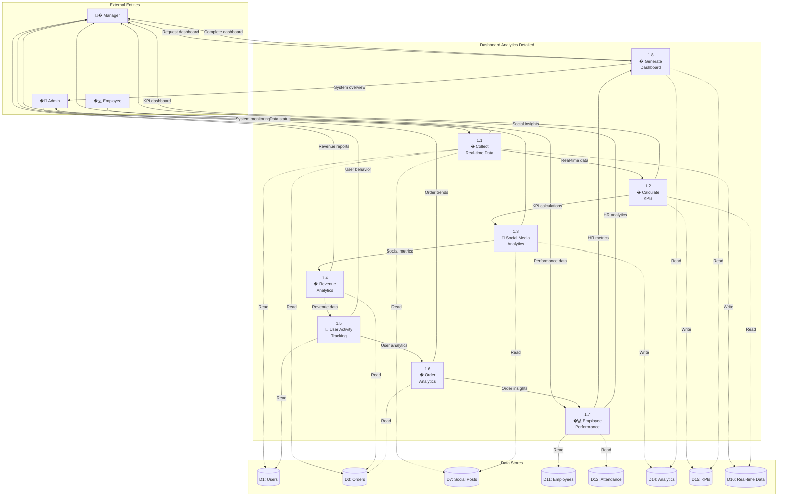
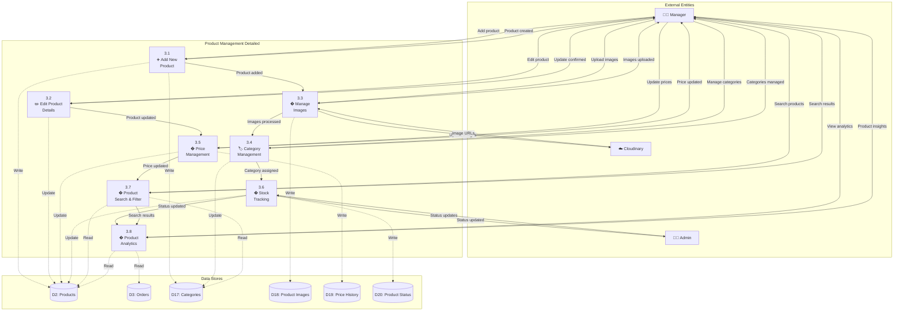
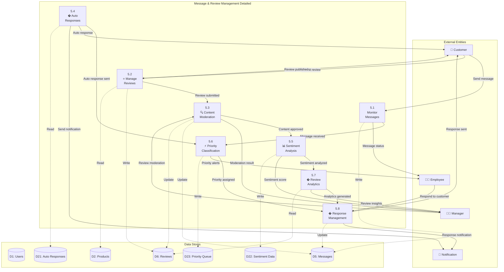
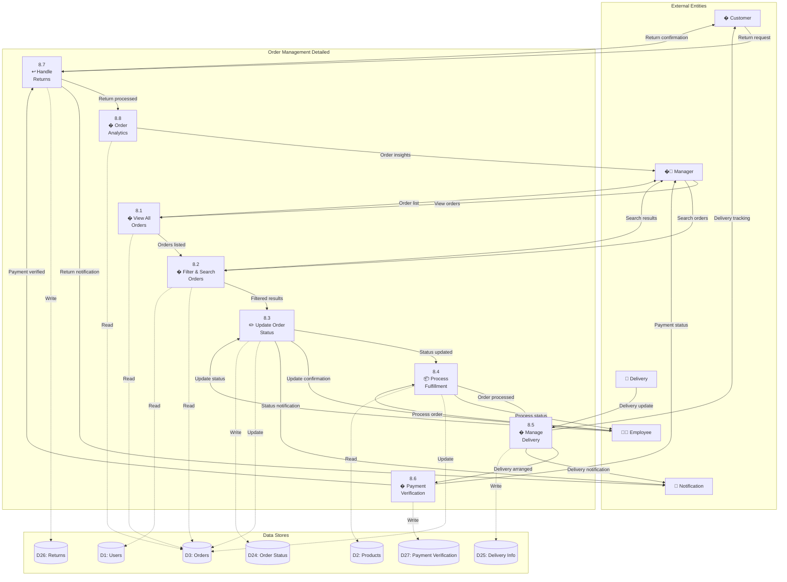
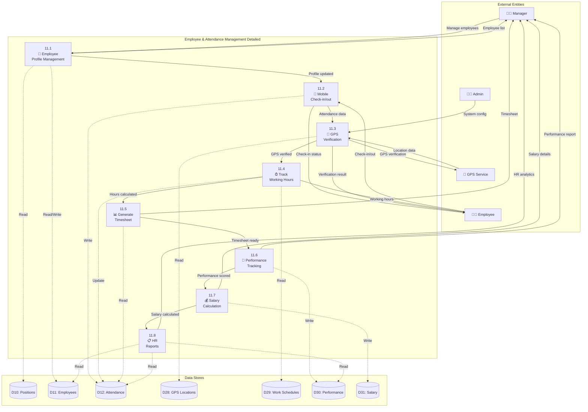

# 💼 Data Flow Diagram (DFD) - Business Management System
## Hệ thống    subgraph "External Entities"
        M[👨‍💼 Manager]
        E[👨‍💻 Employee]
        C[👤 Customer]
        A[👨‍💼 Admin]
    endý Doanh nghiệp - Ấm Coffee & Cake

---

## 🎯 Overview

Sơ đồ luồng dữ liệu mô tả hệ t        P36[3.6<br/>📊 Product<br/>Status]ống quản lý doanh nghiệp toàn diện, bao gồm dashboard, quản lý người dùng, sản phẩm, đơn hàng, nội dung và báo cáo thống kê.

---

## 📋 DFD Level 0 (Context Diagram)



---

## 📊 DFD Level 1 (System Overview)

```mermaid
graph TB
    subgraph "External Entities"
        A[👨‍💼 Admin]
        E[👨‍💻 Employee]
        C[👤 Customer]
        S[🏪 Supplier]
        B[🏦 Bank]
        V[💳 VNPAY Gateway]
        G[☁️ Cloudinary]
        N[📧 Notification]
    end
    
    subgraph "Business Management Processes"
        P1[1.0<br/>📊 Dashboard<br/>Thống kê]
        P2[2.0<br/>👥 Quản lý<br/>Người dùng]
        P3[3.0<br/>📦 Quản lý<br/>Sản phẩm]
        P4[4.0<br/>🏷️ Quản lý<br/>Mã giảm giá]
        P5[5.0<br/>💬 Quản lý Tin nhắn<br/>& Đánh giá]
        P6[6.0<br/>📱 Quản lý Bài đăng<br/>Mạng xã hội]
        P7[7.0<br/>📰 Quản lý<br/>Tin tức]
        P8[8.0<br/>📝 Quản lý<br/>Đơn hàng]
        P9[9.0<br/>⏰ Quản lý<br/>Tin 24h]
        P10[10.0<br/>🎖️ Quản lý<br/>Chức vụ]
        P11[11.0<br/>👨‍💼 Quản lý Nhân viên<br/>& Chấm công]
        P12[12.0<br/>📋 Xuất & Báo cáo<br/>Thống kê]
    end
    
    subgraph "Data Stores"
        D1[(D1: Users<br/>👥 Người dùng)]
        D2[(D2: Products<br/>📦 Sản phẩm)]
        D3[(D3: Orders<br/>📝 Đơn hàng)]
        D4[(D4: Promotions<br/>🎟️ Mã giảm giá)]
        D5[(D5: Messages<br/>💬 Tin nhắn)]
        D6[(D6: Reviews<br/>⭐ Đánh giá)]
        D7[(D7: Social Posts<br/>📱 Bài đăng)]
        D8[(D8: News<br/>📰 Tin tức)]
        D9[(D9: Stories<br/>📸 Tin 24h)]
        D10[(D10: Positions<br/>👔 Chức vụ)]
        D11[(D11: Employees<br/>👨‍💻 Nhân viên)]
        D12[(D12: Attendance<br/>⏰ Chấm công)]
        D13[(D13: Reports<br/>📋 Báo cáo)]
        D14[(D14: Analytics<br/>📊 Thống kê)]
    end
    
    %% Admin flows
    A -->|Xem dashboard| P1
    A -->|Quản lý người dùng| P2
    A -->|Quản lý sản phẩm| P3
    A -->|Thiết lập khuyến mãi| P4
    A -->|Quản lý tin nhắn| P5
    A -->|Quản lý bài đăng| P6
    A -->|Phê duyệt tin tức| P7
    A -->|Quản lý đơn hàng| P8
    A -->|Quản lý tin 24h| P9
    A -->|Quản lý chức vụ| P10
    A -->|Quản lý nhân viên| P11
    A -->|Yêu cầu báo cáo| P12
    
    P1 -->|Dashboard analytics| A
    P2 -->|User reports| A
    P3 -->|Product analytics| A
    P4 -->|Promotion effectiveness| A
    P5 -->|Message insights| A
    P6 -->|Social media insights| A
    P7 -->|News performance| A
    P8 -->|Order analytics| A
    P9 -->|Story analytics| A
    P10 -->|Role hierarchy| A
    P11 -->|HR reports| A
    P12 -->|Export reports| A
    
    %% Employee flows
    E -->|Cập nhật đơn hàng| P8
    E -->|Chấm công| P11
    E -->|Phản hồi khách hàng| P5
    
    P8 -->|Order status| E
    P11 -->|Attendance status| E
    P5 -->|Customer feedback| E
    
    %% Customer flows  
    C -->|Đánh giá sản phẩm| P5
    C -->|Tương tác bài đăng| P6
    C -->|Đặt hàng| P8
    
    P5 -->|Review responses| C
    P6 -->|Social content| C
    P8 -->|Order updates| C
    
    %% External integrations
    S -->|Cung cấp hàng| P3
    P3 -->|Đơn đặt hàng| S
    
    B -->|Giao dịch| P8
    P8 -->|Sao kê| B
    
    V -->|Thanh toán online| P8
    P8 -->|Trạng thái thanh toán| V
    
    G -->|Lưu trữ media| P3
    G -->|Lưu trữ media| P7
    G -->|Lưu trữ media| P6
    G -->|Lưu trữ media| P9
    G -->|Lưu trữ media| P11
    P3 -->|Yêu cầu media| G
    P7 -->|Yêu cầu media| G
    P6 -->|Yêu cầu media| G
    P9 -->|Yêu cầu media| G
    P11 -->|Yêu cầu media| G
    
    N -->|Thông báo| C
    N -->|Thông báo| A
    N -->|Thông báo| E
    P8 -->|Thông báo đơn hàng| N
    P5 -->|Thông báo tin nhắn| N
    
    %% Data store connections
    P1 -.->|Read| D1
    P1 -.->|Read| D3
    P1 -.->|Read| D11
    P1 -.->|Write| D11
    
    P2 -.->|Read/Write| D1
    P2 -.->|Read| D3
    
    P3 -.->|Read/Write| D2
    P3 -.->|Read| D3
    
    P4 -.->|Read/Write| D4
    P4 -.->|Read| D3
    
    P5 -.->|Read/Write| D5
    P5 -.->|Read/Write| D6
    P5 -.->|Read| D2
    
    P6 -.->|Read/Write| D7
    P6 -.->|Read| D1
    
    P7 -.->|Read/Write| D8
    P7 -.->|Read| D1
    
    P8 -.->|Read/Write| D3
    P8 -.->|Read| D2
    P8 -.->|Read| D1
    
    P9 -.->|Read/Write| D9
    P9 -.->|Read| D1
    
    P10 -.->|Read/Write| D10
    
    P11 -.->|Read/Write| D11
    P11 -.->|Read/Write| D12
    P11 -.->|Read| D10
    
    P12 -.->|Read| D1
    P12 -.->|Read| D3
    P12 -.->|Read| D11
    P12 -.->|Read| D11
    P12 -.->|Write| D13
```



---

## 🔍 DFD Level 2 - Chi tiết Process 1.0 (Dashboard Thống kê)



---

## 📦 DFD Level 2 - Chi tiết Process 3.0 (Quản lý Sản phẩm)



---

## 📊 DFD Level 2 - Chi tiết Process 5.0 (Quản lý Tin nhắn & Đánh giá)



---

## 📊 DFD Level 2 - Chi tiết Process 8.0 (Quản lý Đơn hàng)



---

## 👨‍💻 DFD Level 2 - Chi tiết Process 11.0 (Quản lý Nhân viên & Chấm công)



---

## 📊 Data Dictionary (Từ điển Dữ liệu)

### **Data Flows**

| Tên Data Flow | Mô tả | Thành phần dữ liệu |
|---------------|-------|-------------------|
| **Đơn hàng online** | Giao dịch mua hàng online | product_ids + quantities + customer_id + payment_method + total |
| **Cập nhật kho** | Thay đổi tồn kho | product_id + quantity_change + movement_type + employee_id |
| **Quản lý khách hàng** | Thông tin CRM | customer_id + contact_info + purchase_history + loyalty_points |
| **Báo cáo doanh thu** | Báo cáo tài chính | period + sales_total + profit + expenses + taxes |
| **Đặt hàng nhà cung cấp** | Purchase order | supplier_id + products[] + quantities[] + expected_date |

### **Data Stores**

| Data Store | Mô tả | Cấu trúc chính |
|------------|-------|----------------|
| **D1: Users** | Thông tin người dùng | user_id + name + email + phone + role + membership_level + created_date |
| **D2: Products** | Catalog sản phẩm | product_id + name + category + price + description + images + stock + status |
| **D3: Orders** | Đơn hàng | order_id + user_id + items + total + status + payment_method + created_date |
| **D4: Promotions** | Mã giảm giá | promo_id + code + discount_type + value + min_order + expiry_date + usage_limit |
| **D5: Messages** | Tin nhắn khách hàng | message_id + user_id + content + type + status + priority + created_date |
| **D6: Reviews** | Đánh giá sản phẩm | review_id + user_id + product_id + rating + comment + status + created_date |
| **D7: Social Posts** | Bài đăng mạng xã hội | post_id + user_id + content + media + likes + comments + created_date |
| **D8: News** | Tin tức | news_id + title + content + author + category + status + published_date |
| **D9: Stories** | Tin 24h | story_id + user_id + media + text + views + created_date + expires_at |
| **D10: Positions** | Chức vụ nhân viên | position_id + name + level + permissions + salary_range + description |
| **D11: Employees** | Nhân viên | employee_id + name + position_id + contact + hire_date + salary + status |
| **D12: Attendance** | Chấm công | attendance_id + employee_id + check_in + check_out + location + date |
| **D13: Reports** | Báo cáo | report_id + type + data + period + format + created_date |
| **D14: Analytics** | Thống kê | analytics_id + type + data + period + metrics + created_date |

### **Processes**

| Process | Mô tả | Input | Output |
|---------|-------|-------|--------|
| **1.0 Dashboard Thống kê** | Tổng hợp và hiển thị analytics | Real-time data từ tất cả modules | Dashboard với KPIs và insights |
| **2.0 Quản lý Người dùng** | CRUD người dùng, phân quyền | User data, role assignments | User profiles, access control |
| **3.0 Quản lý Sản phẩm** | CRUD sản phẩm, categories | Product info, images, pricing | Product catalog, inventory |
| **4.0 Quản lý Mã giảm giá** | Tạo và quản lý promotions | Discount rules, conditions | Active promotions, usage stats |
| **5.0 Quản lý Tin nhắn & Đánh giá** | Customer support và reviews | Messages, reviews, ratings | Response management, sentiment |
| **6.0 Quản lý Bài đăng Mạng xã hội** | Content moderation | Social posts, comments | Content approval, engagement |
| **7.0 Quản lý Tin tức** | News và content management | Articles, media, metadata | Published content, analytics |
| **8.0 Quản lý Đơn hàng** | Order processing và tracking | Order requests, updates | Order status, fulfillment |
| **9.0 Quản lý Tin 24h** | Stories và temporary content | Story uploads, views | Story feed, analytics |
| **10.0 Quản lý Chức vụ** | Position và role management | Job descriptions, permissions | Organizational structure |
| **11.0 Quản lý Nhân viên & Chấm công** | HR và attendance | Employee data, check-ins | HR reports, payroll data |
| **12.0 Xuất & Báo cáo Thống kê** | Report generation | System data, date ranges | Export files, analytics reports |

---

## 🔄 Business Rules & Constraints

### **Quy tắc Kinh doanh**

1. **Dashboard Thống kê**
   - Real-time data update mỗi 5 phút
   - KPIs được tính toán theo ngày/tuần/tháng
   - Alert tự động khi metrics bất thường
   - Export báo cáo Excel hàng tháng

2. **Quản lý Người dùng**
   - Phân quyền theo role: Admin, Manager, Employee, Customer
   - Session timeout: 8 giờ cho admin, 4 giờ cho user
   - Password policy: Tối thiểu 8 ký tự, có số và ký tự đặc biệt

3. **Quản lý Sản phẩm**
   - Mỗi sản phẩm phải có ít nhất 1 hình ảnh
   - Auto-disable sản phẩm khi stock = 0
   - Price history được lưu trữ cho audit

4. **Quản lý Đơn hàng**
   - Order status flow: Pending → Confirmed → Processing → Shipped → Delivered
   - Auto-cancel orders sau 24h nếu không thanh toán
   - COD orders phải confirm trong 2h

5. **Quản lý Mã giảm giá**
   - Mỗi user chỉ sử dụng 1 mã/đơn hàng
   - Auto-deactivate expired promotions
   - Usage limit theo customer hoặc total

6. **Quản lý Tin nhắn & Đánh giá**
   - Real-time chat giữa admin và customer
   - Message history được lưu trữ
   - Review moderation workflow
   - Sentiment analysis

7. **Quản lý Bài đăng Mạng xã hội**
   - Content moderation system
   - Comment management
   - Like/dislike tracking
   - Engagement analytics

8. **Quản lý Tin tức**
   - Rich text editor với QuillJS
   - Image upload qua Cloudinary
   - Categories: Khuyến Mãi, Mẹo Pha Chế, Sự Kiện, Sản Phẩm Mới
   - Draft và published status

9. **Quản lý Tin 24h**
   - 24-hour expiration
   - Media upload support
   - View tracking
   - Author attribution

10. **Quản lý Chức vụ**
    - Position hierarchy
    - Permission management
    - Salary range definition
    - Role-based access control

11. **Quản lý Nhân viên & Chấm công**
    - Employee profiles với avatar
    - GPS attendance tracking
    - Salary calculation
    - Performance tracking
    - HR analytics

12. **Xuất & Báo cáo Thống kê**
    - Excel export functionality
    - Custom date range reports
    - Multiple format support
    - Automated report generation
   - Auto-deactivate expired promotions
   - Usage limit theo customer hoặc total

6. **Quản lý Nội dung**
   - Auto-moderation cho inappropriate content
   - Stories tự xóa sau 24h
   - News phải được approve trước khi publish

7. **Quản lý Nhân viên**
   - Chấm công GPS trong bán kính 100m
   - OT phải được approve trước
   - Timesheet khóa sau 3 ngày

### **Ràng buộc Kỹ thuật**

1. **Performance**
   - E-commerce response time < 3 seconds
   - Report generation < 30 seconds
   - 99.5% system uptime

2. **Security**
   - Role-based access control
   - Audit trail for all transactions
   - Daily data backup

3. **Integration**
   - Real-time sync with e-commerce
   - API integration with suppliers
   - Mobile app synchronization

---

## 📈 Flow Scenarios

### **Scenario 1: Manager xem dashboard tổng quan**

```
1. Manager → Login Admin Panel → Access Dashboard
2. System → Collect Real-time Data → From All Modules
3. System → Calculate KPIs → Revenue, Orders, Users, Performance
4. System → Generate Charts → Sales trends, Top products
5. System → Display Dashboard → With actionable insights
6. Manager → Drill down → Specific metrics for details
7. System → Show Detailed Reports → Interactive analytics
```

### **Scenario 2: Quản lý sản phẩm và inventory**

```
1. Manager → Navigate to Products → View Product List
2. Manager → Add New Product → Enter Details + Upload Images
3. System → Process Images → Cloudinary Upload
4. System → Validate Data → Check required fields
5. System → Save Product → Update Database
6. System → Update Analytics → Product count, Category stats
7. System → Notify → Product added successfully
8. System → Auto-track → Stock levels and alerts
```

### **Scenario 3: Xử lý đơn hàng online từ A-Z**

```
1. Customer → Place Order → Through E-commerce Website/App
2. System → Create Order → In Admin Dashboard
3. Employee → View Order List → Filter by status
4. Employee → Update Status → Confirmed → Processing
5. System → Update Inventory → Deduct stock
6. Employee → Prepare Order → Mark as Shipped
7. System → Send Notification → To Customer
8. System → Update Analytics → Order completion stats
```

### **Scenario 4: Quản lý nhân viên và chấm công**

```
1. Employee → Mobile Check-in → GPS Location
2. System → Verify Location → Within office radius
3. System → Record Attendance → Timestamp + Location
4. Manager → View Attendance → Dashboard
5. System → Calculate Hours → Regular + Overtime
6. Manager → Generate Timesheet → Weekly/Monthly
7. System → Export Report → HR Analytics
8. System → Calculate Salary → Based on attendance
```

### **Scenario 5: Tạo và xuất báo cáo thống kê**

```
1. Manager → Access Reports → Select Date Range
2. Manager → Choose Report Type → Sales/Users/Products
3. System → Query Database → Collect relevant data
4. System → Process Analytics → Calculate metrics
5. System → Generate Report → Charts + Tables
6. Manager → Customize Report → Add/Remove fields
7. System → Export File → PDF/Excel format
8. System → Email Report → To stakeholders
```

---

*Sơ đồ DFD này mô tả luồng dữ liệu hoàn chỉnh cho hệ thống quản lý doanh nghiệp, từ đơn hàng online đến báo cáo phân tích và quản lý chuỗi cung ứng.*
