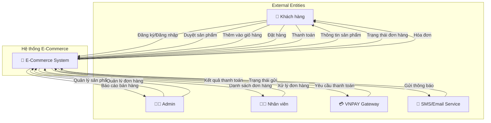
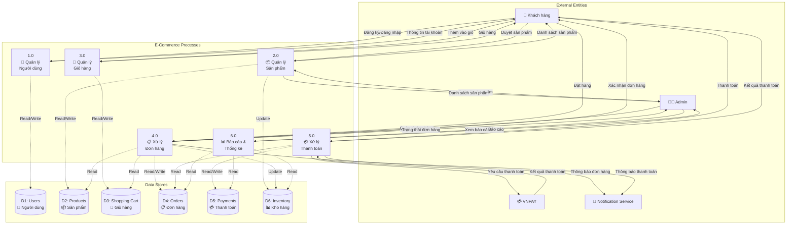
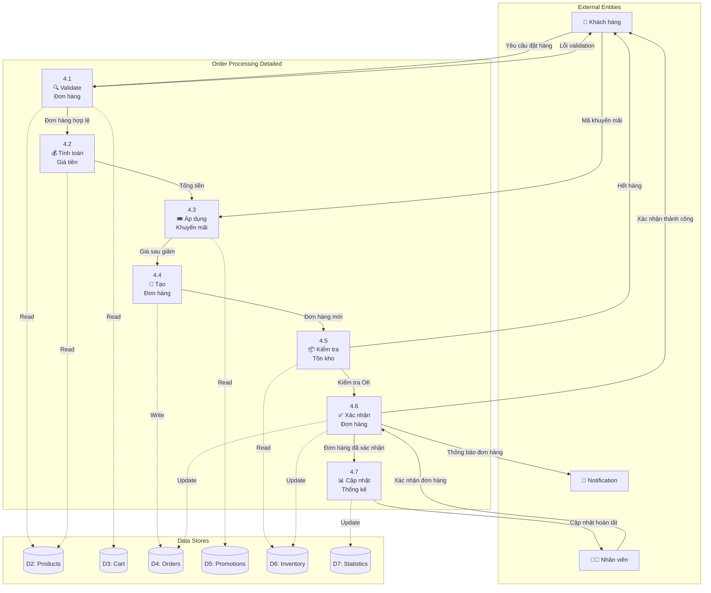
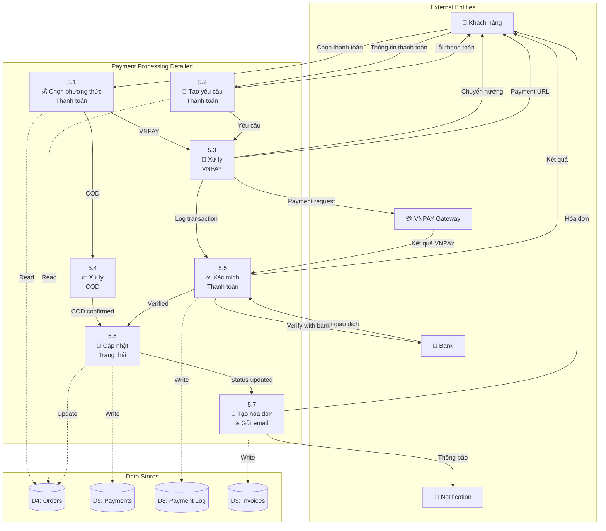
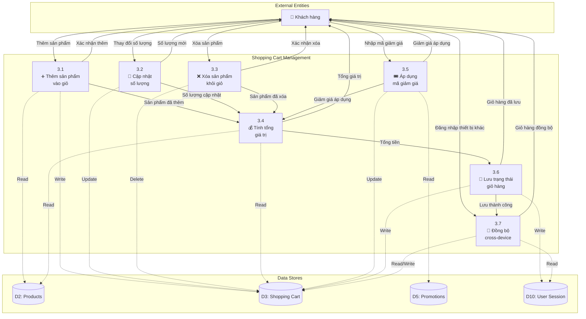

# 📊 Data Flow Diagram (DFD) - E-Commerce System
## Hệ thống Bán hàng Trực tuyến - Ấm Coffee & Cake

---

## 🎯 Overview

Sơ đồ luồng dữ liệu (DFD) mô tả cách dữ liệu di chuyển qua hệ thống bán hàng trực tuyến của Ấm - Coffee and Cake, từ việc khách hàng duyệt sản phẩm đến hoàn tất đơn hàng.

---

## 📋 DFD Level 0 (Context Diagram)



---

## 📊 DFD Level 1 (System Overview)



---

## 🔍 DFD Level 2 - Chi tiết Process 4.0 (Xử lý Đơn hàng)



---

## 💳 DFD Level 2 - Chi tiết Process 5.0 (Xử lý Thanh toán)



---

## 🛒 DFD Level 2 - Chi tiết Process 3.0 (Quản lý Giỏ hàng)



---

## 📊 Data Dictionary (Từ điển Dữ liệu)

### **Data Flows**

| Tên Data Flow | Mô tả | Thành phần dữ liệu |
|---------------|-------|-------------------|
| **Đăng ký/Đăng nhập** | Thông tin xác thực người dùng | email + password + fullName + phone |
| **Duyệt sản phẩm** | Yêu cầu xem danh sách sản phẩm | category + filter + search_term |
| **Thêm vào giỏ** | Thêm sản phẩm vào giỏ hàng | product_id + quantity + options |
| **Đặt hàng** | Thông tin đơn hàng | customer_info + items + delivery_info + payment_method |
| **Thanh toán** | Thông tin thanh toán | order_id + amount + payment_method + customer_info |
| **Kết quả thanh toán** | Phản hồi từ gateway | transaction_id + status + amount + timestamp |

### **Data Stores**

| Data Store | Mô tả | Cấu trúc chính |
|------------|-------|----------------|
| **D1: Users** | Thông tin người dùng | user_id + email + fullName + phone + address + membership |
| **D2: Products** | Catalog sản phẩm | product_id + name + price + category + image + stock |
| **D3: Shopping Cart** | Giỏ hàng | user_id + product_id + quantity + added_date |
| **D4: Orders** | Đơn hàng | order_id + user_id + items + total + status + created_date |
| **D5: Payments** | Thanh toán | payment_id + order_id + amount + method + status + date |
| **D6: Inventory** | Quản lý kho | product_id + current_stock + reserved + last_updated |

### **Processes**

| Process | Mô tả | Input | Output |
|---------|-------|-------|--------|
| **1.0 Quản lý Người dùng** | Xử lý đăng ký, đăng nhập, profile | User credentials, profile data | User session, profile info |
| **2.0 Quản lý Sản phẩm** | CRUD sản phẩm, tìm kiếm | Product data, search queries | Product lists, details |
| **3.0 Quản lý Giỏ hàng** | Thêm/xóa/sửa giỏ hàng | Cart operations | Updated cart |
| **4.0 Xử lý Đơn hàng** | Tạo và xử lý đơn hàng | Order request | Order confirmation |
| **5.0 Xử lý Thanh toán** | COD và VNPAY | Payment request | Payment result |
| **6.0 Báo cáo & Thống kê** | Tạo báo cáo doanh số | Date range, filters | Reports, charts |

---

## 🔄 Business Rules & Constraints

### **Quy tắc Kinh doanh**

1. **Quản lý Giỏ hàng**
   - Mỗi user chỉ có 1 giỏ hàng active
   - Giỏ hàng guest lưu trong 7 ngày
   - Giỏ hàng user đăng nhập lưu vô thời hạn

2. **Xử lý Đơn hàng**
   - Đơn hàng tối thiểu 50,000 VND
   - Kiểm tra tồn kho trước khi xác nhận
   - Đơn hàng có thể hủy trong 30 phút

3. **Thanh toán**
   - COD: Xác nhận ngay, thanh toán khi nhận hàng
   - VNPAY: Phải xác minh trước khi xử lý đơn hàng
   - Timeout thanh toán: 15 phút

4. **Khuyến mãi**
   - Mỗi đơn hàng chỉ áp dụng 1 mã giảm giá
   - Kiểm tra điều kiện và thời hạn mã
   - Tự động áp dụng ưu đãi membership

### **Ràng buộc Kỹ thuật**

1. **Performance**
   - Response time < 2 seconds
   - 99.9% uptime guarantee
   - Support 1000+ concurrent users

2. **Security**
   - HTTPS mandatory
   - Input validation & sanitization
   - Session timeout: 30 minutes

3. **Data Integrity**
   - Transaction rollback on failure
   - Audit trail for all changes
   - Regular backup every 6 hours

---

## 📈 Flow Scenarios

### **Scenario 1: Khách hàng mua hàng thành công**

```
1. Customer → Browse Products → View Product Details
2. Customer → Add to Cart → Update Cart Total
3. Customer → Proceed to Checkout → Login/Register
4. Customer → Enter Shipping Info → Select Payment Method
5. System → Validate Order → Check Inventory
6. System → Process Payment (VNPAY) → Receive Confirmation
7. System → Create Order → Update Inventory
8. System → Send Confirmation Email → Update Order Status
```

### **Scenario 2: Thanh toán thất bại**

```
1. Customer → Confirm Order → Redirect to VNPAY
2. VNPAY → Payment Failed → Return Error Code
3. System → Log Failed Payment → Restore Cart
4. System → Show Error Message → Suggest Retry
5. Customer → Choose Different Payment → Try Again
```

### **Scenario 3: Admin quản lý đơn hàng**

```
1. Admin → Login → View Dashboard
2. Admin → View Orders List → Filter by Status
3. Admin → Select Order → View Details
4. Admin → Update Status → Send Notification
5. System → Log Changes → Update Database
6. System → Notify Customer → Email/SMS
```

---

*Sơ đồ DFD này mô tả luồng dữ liệu hoàn chỉnh cho hệ thống E-Commerce của Ấm - Coffee and Cake, từ cấp độ tổng quan đến chi tiết từng process.*
