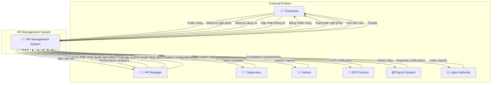
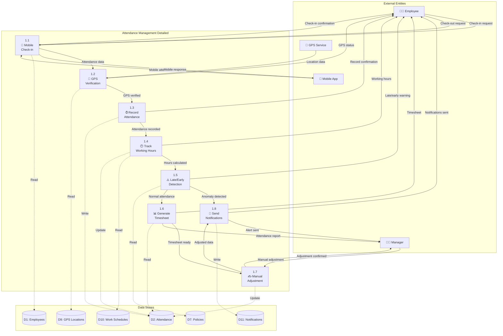
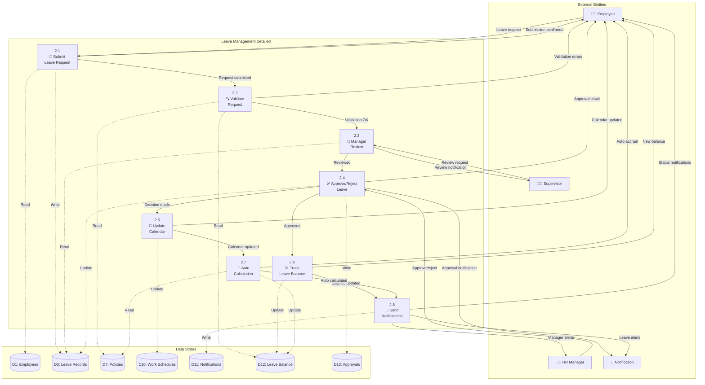
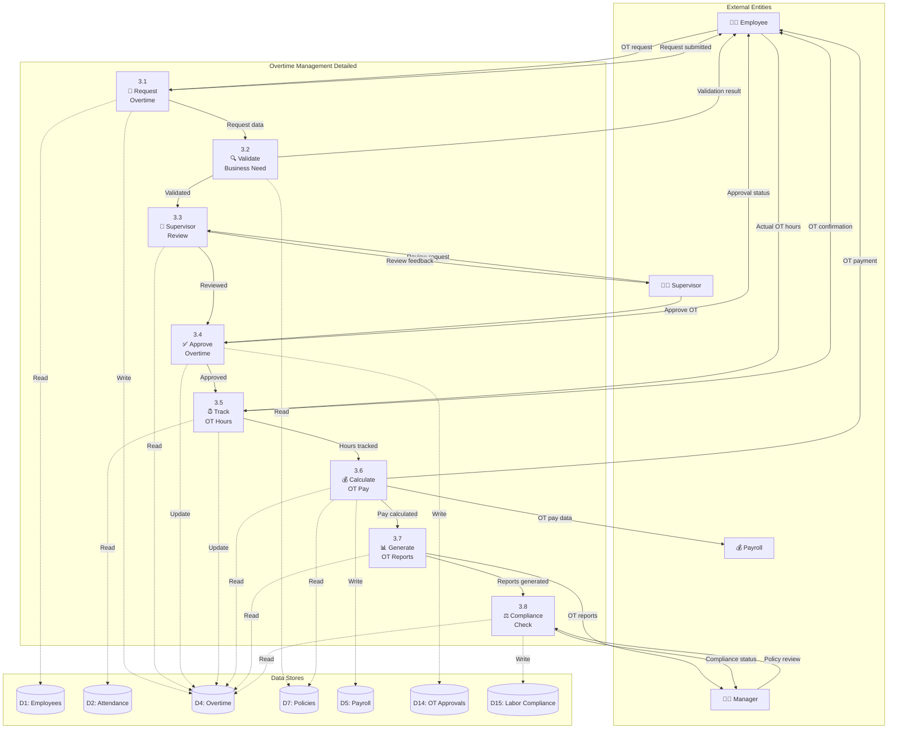
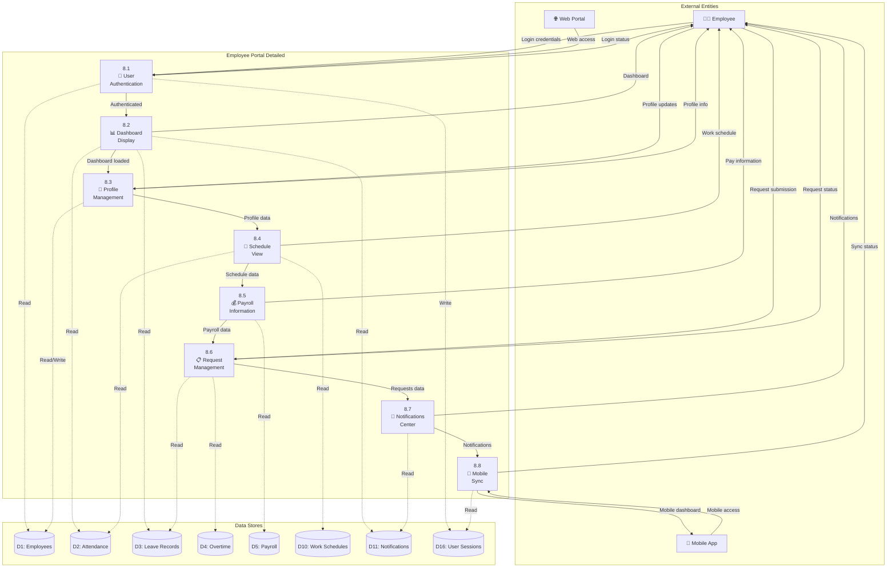

# 👨‍💼 Data Flow Diagram (DFD) - HR Management System
## Hệ thống Quản lý Nhân sự - Ấm Coffee & Cake

---

## 🎯 Overview

Sơ đồ luồng dữ liệu mô tả hệ thống quản lý nhân sự toàn diện, bao gồm chấm công GPS, quản lý nghỉ phép, tăng ca, và cổng thông tin nhân viên.

---

## 📋 DFD Level 0 (Context Diagram)



---

## 📊 DFD Level 1 (System Overview)

```mermaid
graph TB
    subgraph "External Entities"
        E[👨‍💻 Employee]
        M[👨‍💼 HR Manager]
        S[👨‍💼 Supervisor]
        G[📍 GPS Service]
        P[💰 Payroll]
    end
    
    subgraph "HR Management Processes"
        P1[1.0<br/>⏰ Attendance<br/>Management]
        P2[2.0<br/>🏖️ Leave<br/>Management]
        P3[3.0<br/>⏱️ Overtime<br/>Management]
        P4[4.0<br/>👥 Employee<br/>Management]
        P5[5.0<br/>💰 Payroll<br/>Processing]
        P6[6.0<br/>📊 Performance<br/>Evaluation]
        P7[7.0<br/>📋 Compliance<br/>& Reporting]
        P8[8.0<br/>📱 Employee<br/>Portal]
    end
    
    subgraph "Data Stores"
        D1[(D1: Employees<br/>👥 Nhân viên)]
        D2[(D2: Attendance<br/>⏰ Chấm công)]
        D3[(D3: Leave Records<br/>🏖️ Nghỉ phép)]
        D4[(D4: Overtime<br/>⏱️ Tăng ca)]
        D5[(D5: Payroll<br/>💰 Lương)]
        D6[(D6: Performance<br/>📈 Hiệu suất)]
        D7[(D7: Policies<br/>📋 Chính sách)]
        D8[(D8: Reports<br/>📊 Báo cáo)]
    end
    
    %% Employee flows
    E -->|Chấm công GPS| P1
    E -->|Đăng ký nghỉ phép| P2
    E -->|Đăng ký tăng ca| P3
    E -->|Cập nhật profile| P4
    E -->|Truy cập portal| P8
    
    P1 -->|Attendance status| E
    P2 -->|Leave status| E
    P3 -->|Overtime approval| E
    P4 -->|Profile updated| E
    P8 -->|Portal dashboard| E
    
    %% Manager flows
    M -->|Phê duyệt nghỉ phép| P2
    M -->|Review performance| P6
    M -->|Generate reports| P7
    M -->|Manage policies| P7
    
    P2 -->|Leave reports| M
    P6 -->|Performance reports| M
    P7 -->|HR analytics| M
    
    %% Supervisor flows
    S -->|Approve overtime| P3
    S -->|Rate performance| P6
    P3 -->|Overtime reports| S
    P6 -->|Team performance| S
    
    %% External integrations
    P1 -->|GPS verification| G
    G -->|Location confirmed| P1
    
    P5 -->|Salary calculation| P
    P -->|Payment processed| P5
    
    %% Data store connections
    P1 -.->|Read/Write| D2
    P1 -.->|Read| D1
    P2 -.->|Read/Write| D3
    P2 -.->|Read| D1
    P2 -.->|Read| D7
    P3 -.->|Read/Write| D4
    P3 -.->|Read| D1
    P4 -.->|Read/Write| D1
    P5 -.->|Read| D2
    P5 -.->|Read| D3
    P5 -.->|Read| D4
    P5 -.->|Write| D5
    P6 -.->|Read/Write| D6
    P6 -.->|Read| D1
    P7 -.->|Read/Write| D7
    P7 -.->|Read| D2
    P7 -.->|Read| D3
    P7 -.->|Read| D4
    P7 -.->|Write| D8
    P8 -.->|Read| D1
    P8 -.->|Read| D2
    P8 -.->|Read| D3
    P8 -.->|Read| D5
```



---

## 🔍 DFD Level 2 - Chi tiết Process 1.0 (Attendance Management)



---

## 🏖️ DFD Level 2 - Chi tiết Process 2.0 (Leave Management)



---

## ⏱️ DFD Level 2 - Chi tiết Process 3.0 (Overtime Management)



---

## 📱 DFD Level 2 - Chi tiết Process 8.0 (Employee Portal)



---

## 📊 Data Dictionary (Từ điển Dữ liệu)

### **Data Flows**

| Tên Data Flow | Mô tả | Thành phần dữ liệu |
|---------------|-------|-------------------|
| **Chấm công GPS** | Check-in/out với GPS | employee_id + timestamp + location + device_id + photo |
| **Đăng ký nghỉ phép** | Yêu cầu nghỉ phép | employee_id + leave_type + start_date + end_date + reason |
| **Đăng ký tăng ca** | Yêu cầu làm thêm giờ | employee_id + date + hours + reason + supervisor_id |
| **Phê duyệt nghỉ phép** | Duyệt/từ chối nghỉ phép | request_id + decision + comments + approver_id |
| **Bảng chấm công** | Báo cáo chấm công | employee_id + period + total_hours + overtime + absences |

### **Data Stores**

| Data Store | Mô tả | Cấu trúc chính |
|------------|-------|----------------|
| **D1: Employees** | Thông tin nhân viên | employee_id + name + position + department + hire_date + salary |
| **D2: Attendance** | Dữ liệu chấm công | attendance_id + employee_id + date + check_in + check_out + location |
| **D3: Leave Records** | Hồ sơ nghỉ phép | leave_id + employee_id + type + start_date + end_date + status |
| **D4: Overtime** | Tăng ca | overtime_id + employee_id + date + hours + rate + approved_by |
| **D5: Payroll** | Bảng lương | payroll_id + employee_id + period + basic_salary + overtime_pay + deductions |
| **D6: Performance** | Đánh giá hiệu suất | performance_id + employee_id + period + score + goals + feedback |

### **Processes**

| Process | Mô tả | Input | Output |
|---------|-------|-------|--------|
| **1.0 Attendance** | Quản lý chấm công | GPS check-ins, time records | Attendance reports, alerts |
| **2.0 Leave** | Quản lý nghỉ phép | Leave requests, approvals | Leave schedules, balances |
| **3.0 Overtime** | Quản lý tăng ca | OT requests, approvals | OT schedules, payments |
| **4.0 Employee** | Quản lý nhân viên | Employee data, updates | Employee records, reports |
| **5.0 Payroll** | Xử lý lương | Attendance, leave, OT data | Payslips, salary reports |
| **6.0 Performance** | Đánh giá hiệu suất | Goals, feedback, metrics | Performance reports, ratings |

---

## 🔄 Business Rules & Constraints

### **Quy tắc Kinh doanh**

1. **Attendance Management**
   - Chấm công phải trong bán kính 100m từ cửa hàng
   - Late check-in >15 phút = cảnh báo
   - Quên check-out = auto check-out 8 giờ sau check-in

2. **Leave Management**
   - Annual leave: 12 ngày/năm, tích lũy tối đa 24 ngày
   - Sick leave: Cần đăng ký trước >2 ngày (trừ cấp cứu)
   - Maternity leave: 6 tháng theo luật lao động

3. **Overtime Management**
   - Tối đa 40 giờ OT/tháng theo luật
   - OT rate: 150% lương cơ bản (ngày thường), 200% (cuối tuần)
   - Phải được approve trước khi làm

4. **Performance Management**
   - Đánh giá 2 lần/năm (giữa năm + cuối năm)
   - KPIs theo position và department
   - 360-degree feedback cho management level

### **Ràng buộc Kỹ thuật**

1. **GPS & Location**
   - GPS accuracy ±10 meters
   - Offline mode: 24 hours storage
   - Location verification mỗi 30 phút

2. **Security & Privacy**
   - Biometric authentication cho sensitive data
   - Location data encrypted
   - GDPR compliance cho EU employees

3. **Integration & Sync**
   - Real-time sync giữa mobile và web
   - API integration với payroll system
   - Backup data mỗi 6 giờ

---

## 📈 Flow Scenarios

### **Scenario 1: Chấm công GPS thành công**

```
1. Employee → Open Mobile App → Authenticate
2. App → Get GPS Location → Verify with Office Location
3. Employee → Take Selfie → Submit Check-in
4. System → Validate Location → Within Radius OK
5. System → Record Attendance → Update Database
6. System → Send Confirmation → To Employee & Manager
7. System → Update Dashboard → Real-time Status
```

### **Scenario 2: Đăng ký và phê duyệt nghỉ phép**

```
1. Employee → Submit Leave Request → Through Portal
2. System → Validate Leave Balance → Check Availability
3. System → Send to Supervisor → For Review
4. Supervisor → Review Request → Approve/Reject
5. System → Update Leave Calendar → Block Dates
6. System → Calculate New Balance → Update Records
7. System → Notify Employee → Email/Push Notification
8. System → Update Payroll → Deduct Leave Days
```

### **Scenario 3: Tính lương tự động hàng tháng**

```
1. System → Collect Attendance Data → Full Month
2. System → Calculate Working Hours → Regular + OT
3. System → Apply Leave Deductions → Unpaid Leave
4. System → Calculate Gross Salary → Base + OT + Allowances
5. System → Apply Deductions → Tax + Insurance + Other
6. System → Generate Payslip → PDF Format
7. System → Send to Employee → Email + Portal
8. System → Export to Payroll → Bank Transfer File
```

---

*Sơ đồ DFD này mô tả luồng dữ liệu hoàn chỉnh cho hệ thống quản lý nhân sự, từ chấm công GPS đến xử lý lương và đánh giá hiệu suất.*
