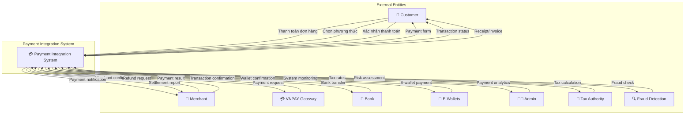
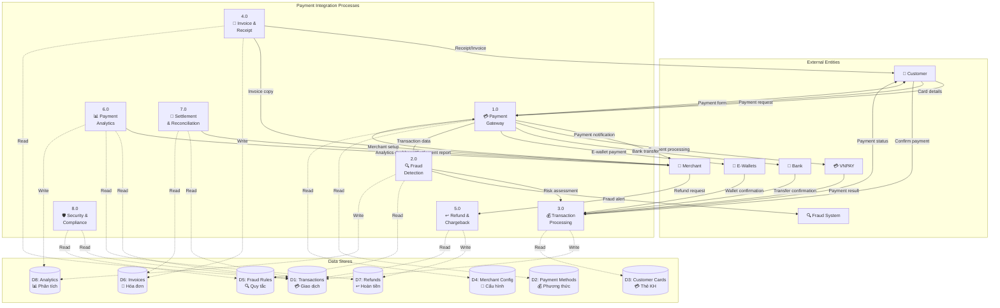
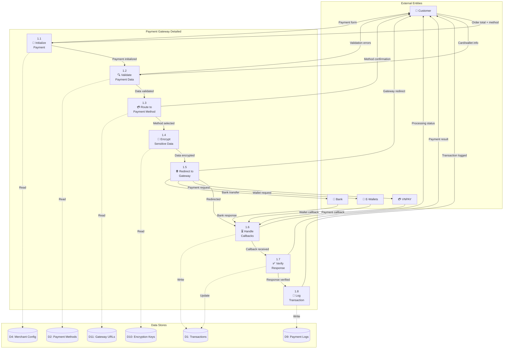
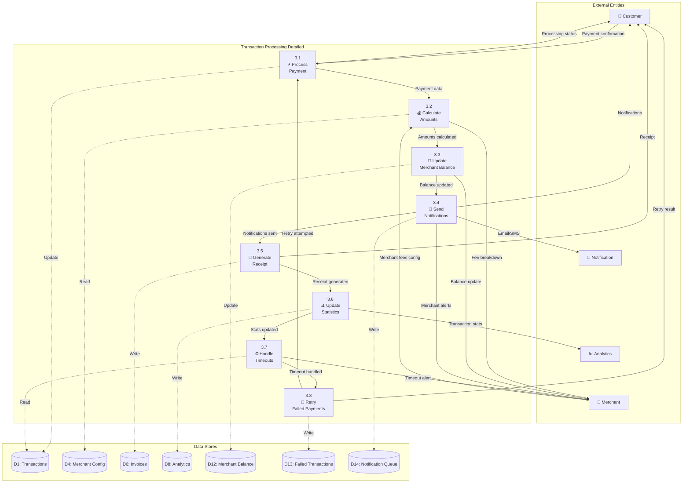
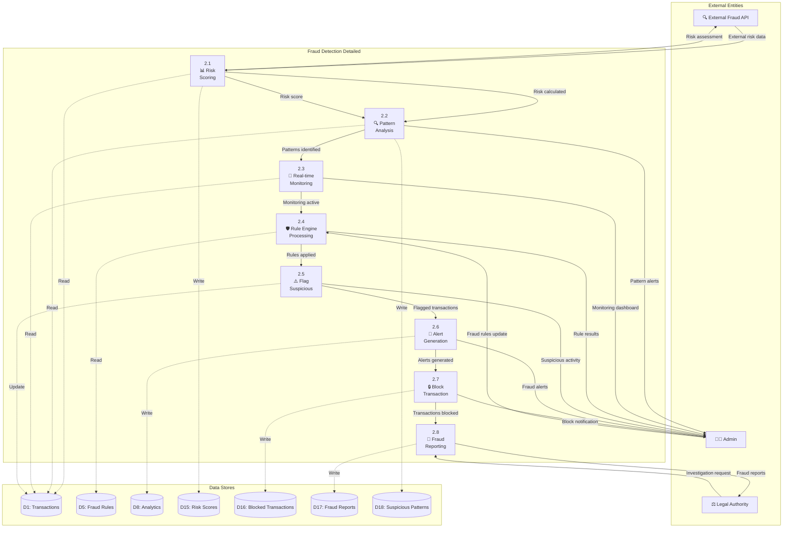
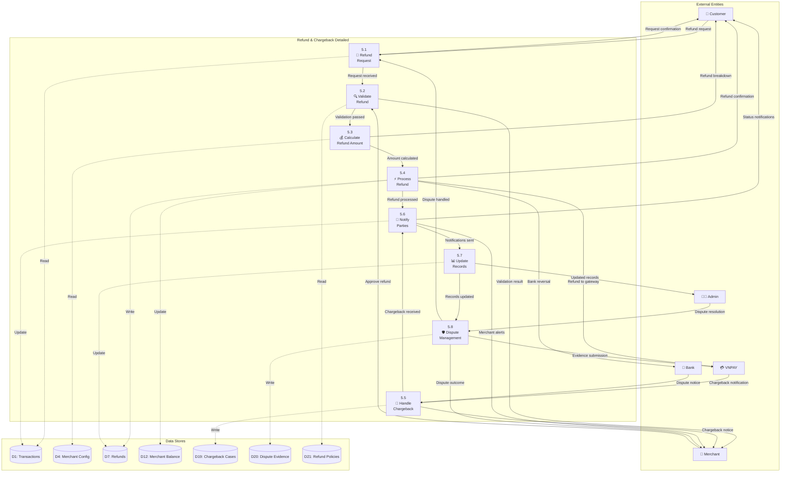

# 💳 Data Flow Diagram (DFD) - Payment Integration System
## Hệ thống Tích hợp Thanh toán - Ấm Coffee & Cake

---

## 🎯 Overview

Sơ đồ luồng dữ liệu mô tả hệ thống tích hợp thanh toán đa dạng, bao gồm VNPAY gateway, COD, ví điện tử, và xử lý refund/chargeback.

---

## 📋 DFD Level 0 (Context Diagram)



---

## 📊 DFD Level 1 (System Overview)



---

## 🔍 DFD Level 2 - Chi tiết Process 1.0 (Payment Gateway)



---

## 💰 DFD Level 2 - Chi tiết Process 3.0 (Transaction Processing)



---

## 🔍 DFD Level 2 - Chi tiết Process 2.0 (Fraud Detection)



---

## ↩️ DFD Level 2 - Chi tiết Process 5.0 (Refund & Chargeback)



---

## 📊 Data Dictionary (Từ điển Dữ liệu)

### **Data Flows**

| Tên Data Flow | Mô tả | Thành phần dữ liệu |
|---------------|-------|-------------------|
| **Thanh toán đơn hàng** | Yêu cầu thanh toán | order_id + amount + currency + customer_id + payment_method |
| **Payment result** | Kết quả thanh toán | transaction_id + status + amount + gateway_response + timestamp |
| **Refund request** | Yêu cầu hoàn tiền | transaction_id + refund_amount + reason + customer_id |
| **Fraud alert** | Cảnh báo gian lận | transaction_id + risk_score + fraud_type + blocked_reason |
| **Settlement report** | Báo cáo đối soát | period + total_amount + fees + net_settlement + transaction_count |

### **Data Stores**

| Data Store | Mô tả | Cấu trúc chính |
|------------|-------|----------------|
| **D1: Transactions** | Giao dịch thanh toán | transaction_id + order_id + amount + status + gateway + created_at |
| **D2: Payment Methods** | Phương thức thanh toán | method_id + name + type + gateway + fees + active_status |
| **D3: Customer Cards** | Thẻ khách hàng | card_id + customer_id + masked_number + expiry + brand + is_default |
| **D4: Merchant Config** | Cấu hình merchant | merchant_id + gateway_config + fees + settlement_account |
| **D5: Fraud Rules** | Quy tắc chống gian lận | rule_id + condition + action + priority + active |
| **D6: Invoices** | Hóa đơn | invoice_id + transaction_id + amount + tax + customer_info |

### **Processes**

| Process | Mô tả | Input | Output |
|---------|-------|-------|--------|
| **1.0 Payment Gateway** | Cổng thanh toán | Payment requests | Payment processing |
| **2.0 Fraud Detection** | Phát hiện gian lận | Transaction data | Risk assessment, alerts |
| **3.0 Transaction Processing** | Xử lý giao dịch | Payment confirmations | Transaction records |
| **4.0 Invoice & Receipt** | Hóa đơn & biên lai | Transaction data | Invoices, receipts |
| **5.0 Refund & Chargeback** | Hoàn tiền & tranh chấp | Refund requests | Refund processing |
| **6.0 Analytics** | Phân tích thanh toán | Transaction data | Reports, insights |

---

## 🔄 Business Rules & Constraints

### **Quy tắc Kinh doanh**

1. **Payment Processing**
   - Minimum transaction: 1,000 VND
   - Maximum daily limit: 50,000,000 VND/customer
   - Session timeout: 15 minutes for payment form

2. **Fraud Detection**
   - Auto-block transactions >5,000,000 VND from new cards
   - Velocity check: Max 5 transactions/hour/card
   - Geographic check: Warn if payment location differs >100km

3. **Refund Policy**
   - Full refund: Within 24 hours of purchase
   - Partial refund: 70% after 24-72 hours
   - No refund: After 7 days (except special cases)

4. **Settlement**
   - Daily settlement for transactions >100
   - Weekly settlement for smaller volumes
   - Hold period: 2 days for new merchants

### **Ràng buộc Kỹ thuật**

1. **Performance**
   - Payment processing: <5 seconds
   - Fraud check: <2 seconds
   - Gateway response: <10 seconds

2. **Security**
   - PCI DSS Level 1 compliance
   - End-to-end encryption for card data
   - Token-based card storage (no raw PAN)

3. **Availability**
   - 99.9% uptime guarantee
   - Failover to backup gateway <30 seconds
   - Real-time monitoring and alerts

---

## 📈 Flow Scenarios

### **Scenario 1: Thanh toán VNPAY thành công**

```
1. Customer → Select VNPAY → Enter Amount
2. System → Generate Payment URL → Redirect to VNPAY
3. Customer → Enter Bank Info → Confirm Payment
4. VNPAY → Process Payment → Send Callback
5. System → Verify Signature → Update Transaction
6. System → Send Confirmation → To Customer & Merchant
7. System → Generate Receipt → Email/SMS
8. System → Update Analytics → Dashboard Metrics
```

### **Scenario 2: Phát hiện và chặn giao dịch gian lận**

```
1. Customer → Submit Payment → High Amount
2. System → Run Fraud Check → Multiple Risk Factors
3. System → Calculate Risk Score → >80 (High Risk)
4. System → Block Transaction → Automatic
5. System → Alert Admin → Real-time Notification
6. System → Notify Customer → Explain Block Reason
7. Admin → Review Case → Manual Investigation
8. Admin → Whitelist/Maintain Block → Decision
```

### **Scenario 3: Xử lý refund tự động**

```
1. Customer → Request Refund → Through Portal
2. System → Validate Request → Check Policy
3. System → Calculate Amount → Include Fees
4. System → Process Refund → Through Original Gateway
5. Gateway → Return Funds → To Customer Account
6. System → Update Records → Transaction Status
7. System → Notify Parties → Customer & Merchant
8. System → Generate Report → Refund Analytics
```

---

*Sơ đồ DFD này mô tả luồng dữ liệu hoàn chỉnh cho hệ thống tích hợp thanh toán, từ xử lý giao dịch cơ bản đến chống gian lận và quản lý tranh chấp.*
