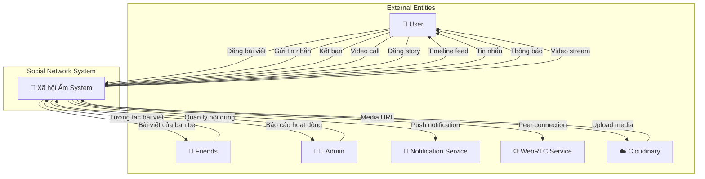
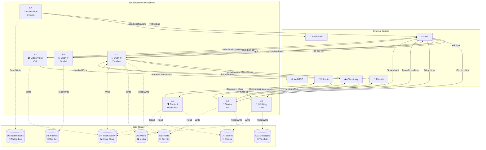
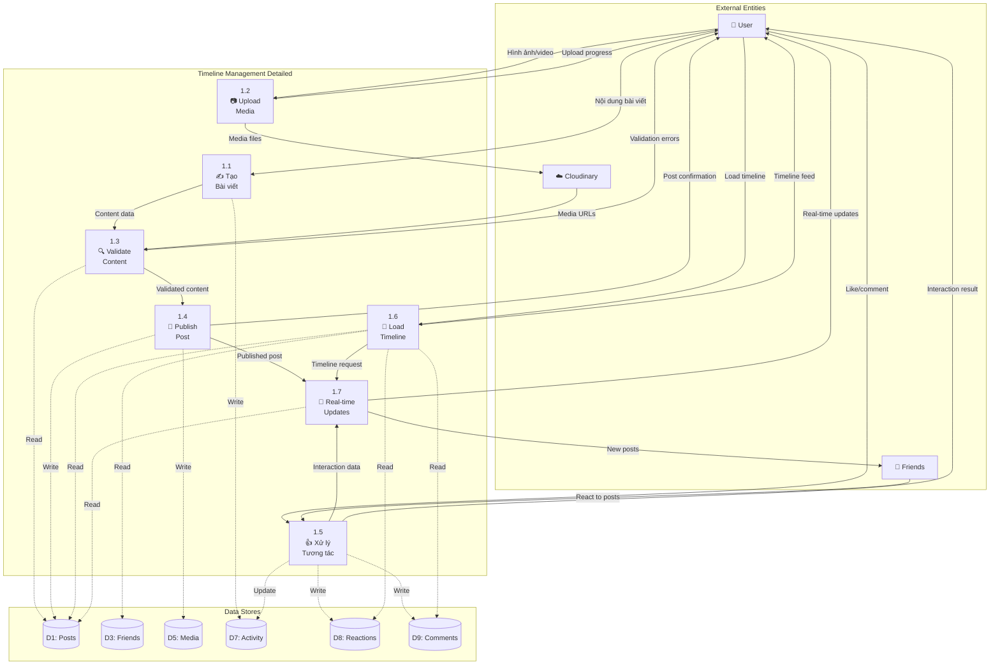
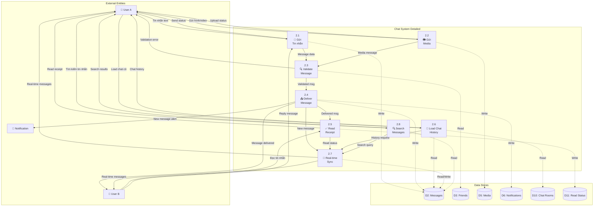
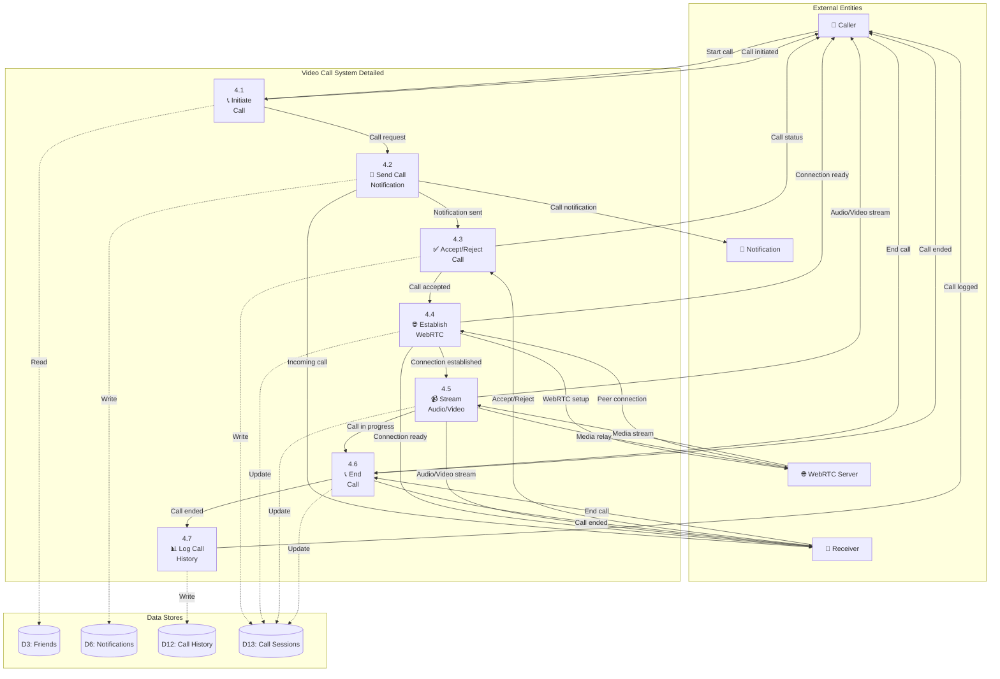
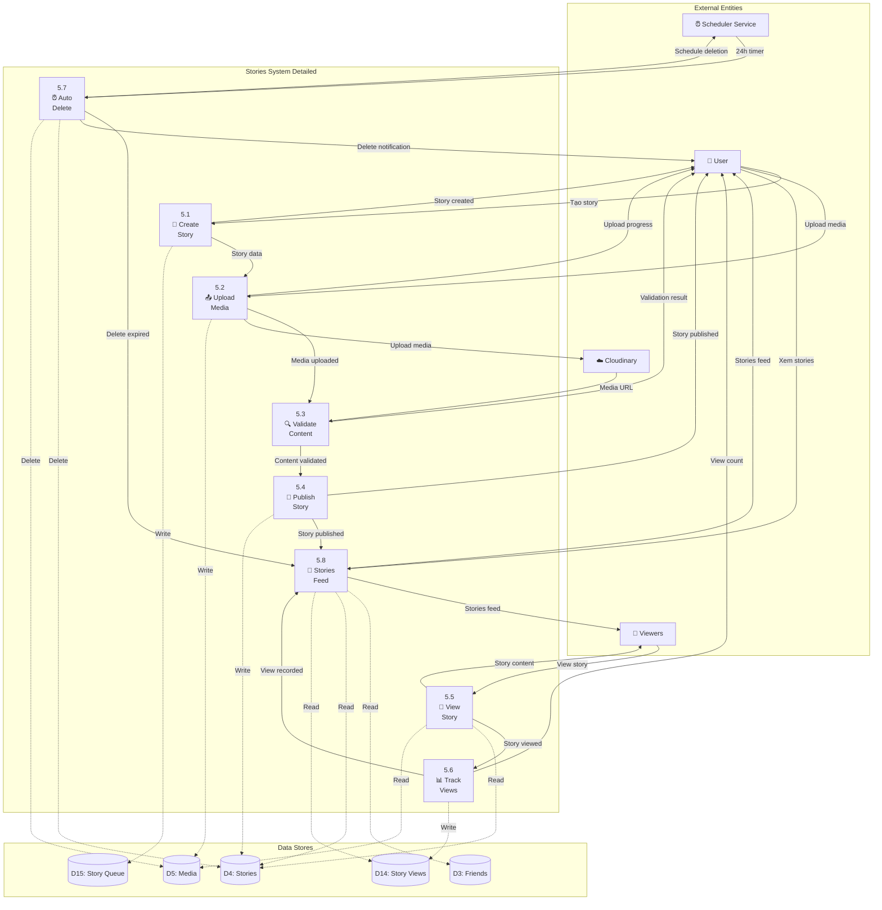

# 👥 Data Flow Diagram (DFD) - Social Network System
## Mạng xã hội "Xã hội Ấm" - Coffee & Cake

---

## 🎯 Overview

Sơ đồ luồng dữ liệu mô tả hoạt động của mạng xã hội nội bộ "Xã hội Ấm", bao gồm timeline, chat, video call, stories và hệ thống kết bạn.

---

## 📋 DFD Level 0 (Context Diagram)



---

## 📊 DFD Level 1 (System Overview)



---

## 🔍 DFD Level 2 - Chi tiết Process 1.0 (Quản lý Timeline)



---

## 💬 DFD Level 2 - Chi tiết Process 2.0 (Hệ thống Chat)



---

## 📹 DFD Level 2 - Chi tiết Process 4.0 (Video/Voice Call)



---

## 📸 DFD Level 2 - Chi tiết Process 5.0 (Stories 24h)



---

## 📊 Data Dictionary (Từ điển Dữ liệu)

### **Data Flows**

| Tên Data Flow | Mô tả | Thành phần dữ liệu |
|---------------|-------|-------------------|
| **Đăng bài viết** | Tạo bài viết mới | user_id + content + media + privacy_setting |
| **Gửi tin nhắn** | Nhắn tin realtime | sender_id + receiver_id + message + media |
| **Kết bạn** | Yêu cầu kết bạn | requester_id + target_id + message |
| **Video call** | Cuộc gọi video | caller_id + receiver_id + call_type |
| **Đăng story** | Story 24h | user_id + media + text + duration |
| **Timeline feed** | Bảng tin cá nhân | posts[] + reactions[] + comments[] |

### **Data Stores**

| Data Store | Mô tả | Cấu trúc chính |
|------------|-------|----------------|
| **D1: Posts** | Bài viết timeline | post_id + user_id + content + media + timestamp + reactions |
| **D2: Messages** | Tin nhắn chat | message_id + chat_id + sender_id + content + timestamp |
| **D3: Friends** | Quan hệ bạn bè | user_id + friend_id + status + created_date |
| **D4: Stories** | Stories 24h | story_id + user_id + media + text + created_date + expires_at |
| **D5: Media** | File media | media_id + url + type + size + uploaded_by |
| **D6: Notifications** | Thông báo | notification_id + user_id + type + content + read_status |

### **Processes**

| Process | Mô tả | Input | Output |
|---------|-------|-------|--------|
| **1.0 Timeline** | Quản lý bảng tin | Post content, interactions | Timeline feed, notifications |
| **2.0 Chat** | Hệ thống nhắn tin | Messages, media | Real-time chat, delivery status |
| **3.0 Friends** | Quản lý bạn bè | Friend requests | Friend lists, relationship status |
| **4.0 Video Call** | Cuộc gọi A/V | Call requests | WebRTC streams, call history |
| **5.0 Stories** | Stories 24h | Story content | Stories feed, view analytics |
| **6.0 Notifications** | Thông báo | Activity events | Push notifications, alerts |

---

## 🔄 Business Rules & Constraints

### **Quy tắc Kinh doanh**

1. **Timeline & Posts**
   - Mỗi bài viết có thể chứa tối đa 10 hình ảnh
   - Video tối đa 5 phút
   - Auto-delete posts sau 1 năm nếu không có tương tác

2. **Chat System**
   - Message history lưu vô thời hạn
   - File attachment tối đa 50MB
   - Group chat tối đa 100 members

3. **Stories**
   - Tự động xóa sau 24 giờ
   - Tối đa 100 story views được hiển thị
   - Media tối đa 15 giây (video)

4. **Video Calls**
   - Tối đa 8 người trong group call
   - Call timeout sau 4 giờ
   - Ghi log tất cả cuộc gọi

5. **Privacy & Security**
   - Chỉ bạn bè mới nhắn tin được
   - Stories có thể set public/friends only
   - Admin có thể moderate tất cả content

### **Ràng buộc Kỹ thuật**

1. **Real-time Performance**
   - Message delivery < 1 second
   - Timeline updates < 2 seconds
   - Video call latency < 200ms

2. **Storage & Media**
   - Images auto-compress 80% quality
   - Videos transcode to 720p max
   - CDN cache cho media files

3. **Scalability**
   - Support 10,000+ concurrent users
   - Horizontal scaling cho chat
   - Load balancing cho WebRTC

---

## 📈 Flow Scenarios

### **Scenario 1: Đăng bài viết có hình ảnh**

```
1. User → Create Post → Add Text Content
2. User → Upload Images → Cloudinary Processing
3. System → Validate Content → Check Guidelines
4. System → Publish Post → Update Timeline
5. System → Notify Friends → Send Push Notifications
6. Friends → View Post → Load in Timeline
7. Friends → React/Comment → Real-time Updates
```

### **Scenario 2: Video call giữa 2 người**

```
1. User A → Initiate Call → Select Friend
2. System → Send Notification → To User B
3. User B → Accept Call → Start WebRTC
4. WebRTC → Establish Connection → P2P Stream
5. System → Log Call Start → Record Activity
6. Users → Video/Audio Stream → Real-time Communication
7. User → End Call → Cleanup Resources
8. System → Log Call End → Save History
```

### **Scenario 3: Đăng story và xem analytics**

```
1. User → Create Story → Add Media + Text
2. System → Upload to Cloudinary → Get URLs
3. System → Publish Story → Add to Feed
4. Friends → View Story → Track Views
5. System → Count Views → Real-time Analytics
6. Timer → 24h Expired → Auto Delete
7. System → Clean Media → Remove from CDN
```

---

*Sơ đồ DFD này mô tả luồng dữ liệu hoàn chỉnh cho mạng xã hội "Xã hội Ấm", từ các tính năng cơ bản như timeline, chat đến các tính năng nâng cao như video call và stories.*
