# 🛠️ Data Flow Diagram (DFD) – Hệ thống Quản trị "Ấm - Coffee & Cake"

Tài liệu mô tả luồng dữ liệu của hệ thống quản trị (AdminDashboard.html) với các phân hệ: Đăng nhập & phân quyền, Dashboard thống kê, QL Người dùng, QL Sản phẩm, QL Mã giảm giá, QL Đơn hàng & POS (VNPay), QL Tin nhắn & Đánh giá, QL Bài đăng MXH, QL Tin tức, QL Tin 24h, QL Chức vụ, QL Nhân viên & Chấm công, Xuất báo cáo.

Hệ thống sử dụng Firebase (Auth + Realtime Database; ảnh dùng Cloudinary), Chart.js (biểu đồ), Quill (rich text), XLSX (xuất Excel).

Tệp sơ đồ .drawio tương ứng: DFD-Admin.drawio (7 trang: Context, Level 1 Overview, POS & Orders Detail, HR & Payroll Detail, News Management Detail (Cloudinary), Products Management Detail (Cloudinary), Promotions Detail).

---

## 📦 Ánh xạ Kho dữ liệu (Firebase RTDB)
- D1 Users: `/users/{uid}`
- D2 Products: `/products/{productId}`
- D3 Promotions: `/promotions/{promotionId}`
- D4 Orders: `/orders/{orderId}`
- D5 Messages: `/messages/{userId}/{messageId}`
- D6 Reviews: `/reviews/{reviewId}` (hoặc theo user)
- D7 Posts: `/posts/{postId}`
- D8 PostComments: `/postComments/{postId}/{commentId}`
- D9 News: `/news/{newsId}`
- D10 Stories: `/stories/{storyId}`
- D11 Staffs: `/staffs/{staffId}`
- D12 Roles: `/roles/{roleId}`
- D13 Attendance: `/attendance/{staffId}/{yyyy-mm-dd}`
- D14 LeaveRequests: `/leaveRequests/{staffId}/{requestId}`
- D15 Notifications: `/notifications/{notificationId}`
- D16 ActivityLogs: `/adminLogs/{logId}`
- D17 Payments: `/payments/{paymentId}` (tuỳ chọn nếu theo dõi giao dịch)

Ảnh (sản phẩm, tin tức, avatar, stories) lưu Cloudinary, DB chỉ lưu URL.

---

## 🧭 DFD Level 0 – Sơ đồ ngữ cảnh

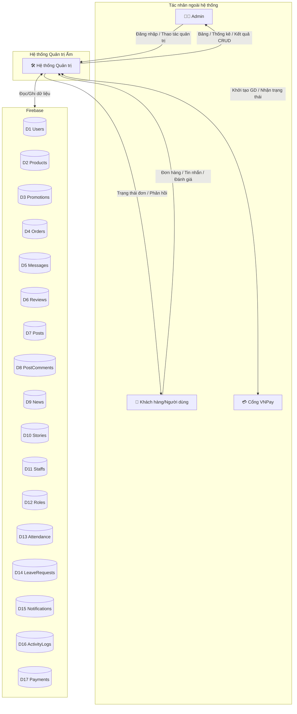

---

## 🧩 DFD Level 1 – Toàn cảnh các tiến trình

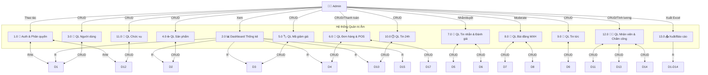

---

## 🔎 DFD Level 2 – Chi tiết các tiến trình chính

### 2.0 📊 Dashboard Thống kê

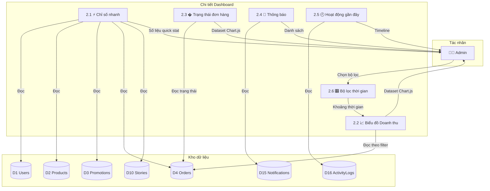

Ghi chú: doanh thu không tính đơn huỷ; best seller tính theo số lượng item; chuẩn hoá timezone.

---

### 3.0 👥 QL Người dùng

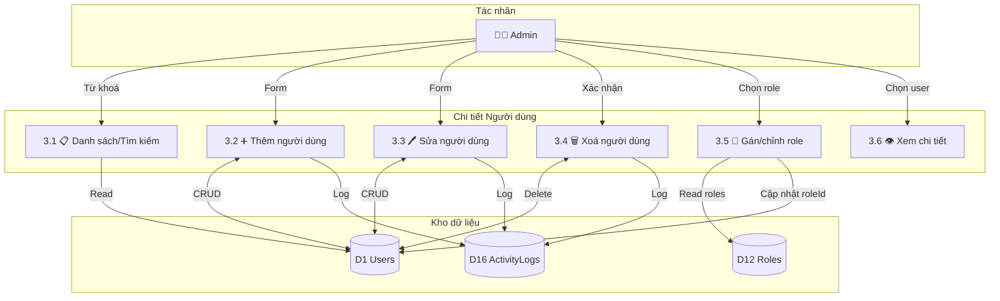

Ghi chú: email duy nhất; cân nhắc ràng buộc xoá nếu có liên quan đơn hàng.

---

### 5.0 🏷️ QL Mã giảm giá

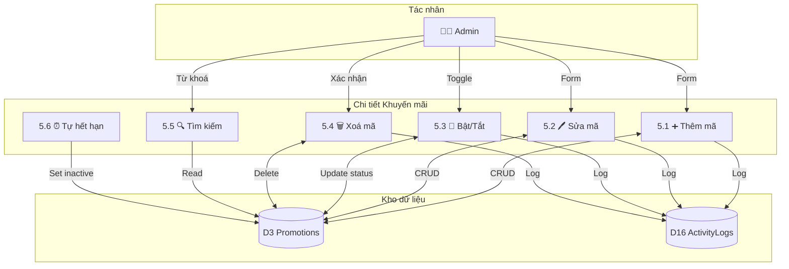

Ghi chú: discountPct 1–100; startDate ≤ endDate; code không trùng; xử lý hết hạn khi load.

---
### 6.0 �🧾 QL Đơn hàng & POS (kèm VNPay, In bill)

```mermaid
graph TB
  subgraph "Tác nhân & Dịch vụ"
    A[👨‍💼 Admin]
    CUS[👤 Khách]
    VNP[💳 VNPay]
  end

  subgraph "Chi tiết Đơn hàng & POS"
    P61[6.1 🛒 Tạo Order POS (Cash)]
    P62[6.2 💳 Tạo Order POS (VNPay)]
    P63[6.3 🔄 Cập nhật trạng thái]
    P64[6.4 📜 Lịch sử/Chi tiết đơn]
    P65[6.5 🔍 Tìm kiếm/Lọc]
  end

  subgraph "Kho dữ liệu"
    D2[(D2 Products)]
    D3[(D3 Promotions)]
    D4[(D4 Orders)]
    D17[(D17 Payments)]
    D16[(D16 ActivityLogs)]
  end

  %% Luồng vào
  A -->|Chọn món, SL, mã KM| P61
  A -->|Chọn món, SL, mã KM| P62
  A -->|Đổi trạng thái| P63
  A -->|Xem chi tiết| P64
  A -->|Tìm kiếm| P65

  %% Xử lý
  P61 -->|Đọc giá/thuộc tính| D2
  P61 -->|Áp mã KM| D3
  P61 -->|Ghi đơn (cash)| D4
  P61 -->|Ghi log| D16

  P62 -->|Khởi tạo GD| VNP
  VNP -->|KQ giao dịch| P62
  P62 -->|Ghi thanh toán| D17
  P62 -->|Ghi đơn (vnpay)| D4
  P62 -->|Ghi log| D16

  P63 -->|Update status| D4
  P63 -->|Ghi log| D16

  P64 -->|Đọc đơn gần đây| D4
  P65 -->|Đọc theo filter| D4

  %% Kết quả
  P61 -->|Bill/Print| A
  P62 -->|QR/Trạng thái| A
  P63 -->|Trạng thái mới| CUS
  P64 -->|Chi tiết| A
  P65 -->|Danh sách| A
```

Quy tắc chính: không tính doanh thu cho đơn hủy; kiểm tra trạng thái hợp lệ (không chuyển ngược); timeout VNPay; làm tròn tiền; lưu log thao tác.

---

### 12.0 🧑‍🍳 QL Nhân viên & Chấm công (tính lương tháng)

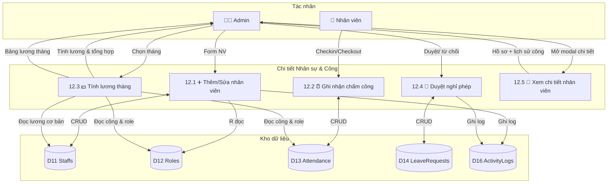

Quy tắc tính lương (tóm tắt): chỉ tính từ ngày bắt đầu làm việc; một ngày hợp lệ phải có đủ vào/ra và ≥ 30 phút; nghỉ có phép tính theo đơn đã duyệt; nghỉ không phép trừ 5% lương cơ bản/ngày; ≥ 392 giờ/tháng nhận full lương cơ bản, < 392 giờ: giờ thực tế × lương giờ cơ bản (làm tròn).

---

### 7.0 💬 QL Tin nhắn & Đánh giá

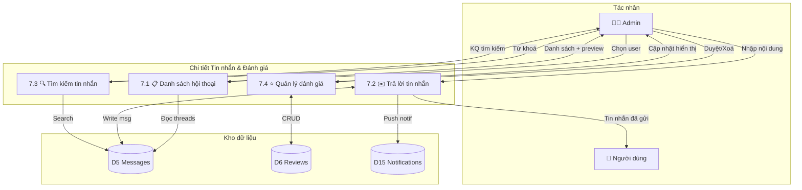

Quy tắc: giới hạn 500 ký tự, lọc nội dung vi phạm, đánh dấu đã đọc, đồng bộ thời gian.

---

### 4.0 ☕ QL Sản phẩm

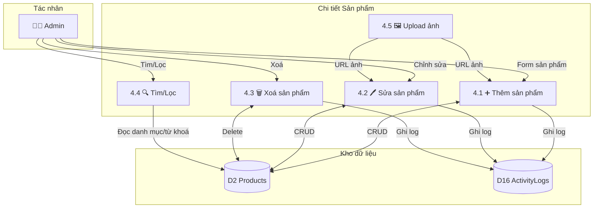

Quy tắc: giá > 0, danh mục hợp lệ, dọn ảnh cũ khi thay ảnh, không xoá nếu đang thuộc đơn chưa hoàn tất (nếu ràng buộc kinh doanh áp dụng).

---

### 8.0 📣 QL Bài đăng MXH

```mermaid
graph TB
  subgraph "Tác nhân"
    A[👨‍💼 Admin]
    U[👤 Người dùng]
  end

  subgraph "Chi tiết Bài đăng & Bình luận"
    P81[8.1 📋 Danh sách bài]
    P82[8.2 👁️ Xem chi tiết (modal)]
    P83[8.3 🗑️ Xoá bình luận]
    P84[8.4 🗑️ Xoá bài đăng]
    P85[8.5 🔍 Tìm kiếm/Lọc]
  end

  subgraph "Kho dữ liệu"
    D7[(D7 Posts)]
    D8[(D8 PostComments)]
    D16[(D16 ActivityLogs)]
  end

  A -->|Mở trang| P81
  A -->|Chọn bài| P82
  A -->|Xoá cmt| P83
  A -->|Xoá bài| P84
  A -->|Từ khoá/Lọc| P85

  P81 -->|Read| D7
  P82 -->|Read comments| D8
  P83 <-->|Delete| D8
  P84 <-->|Delete| D7
  P85 -->|Read| D7
  P83 -->|Log| D16
  P84 -->|Log| D16
```

Ghi chú: ghi log xóa; cân nhắc khôi phục (soft delete) nếu cần.

---

### 9.0 📰 QL Tin tức

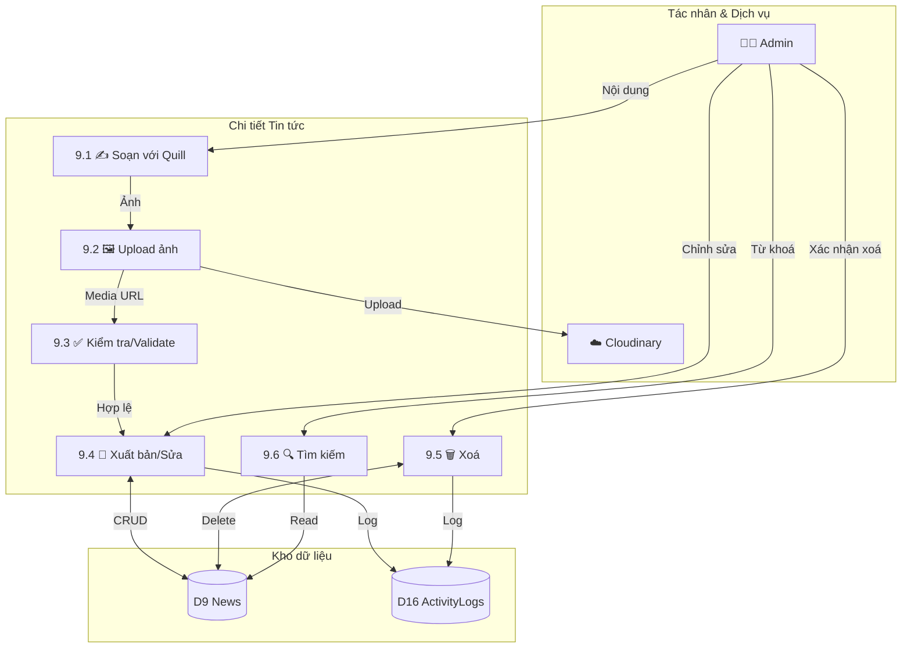

Ghi chú: sanitize HTML; alt bắt buộc; ngày hợp lệ.

---

### 10.0 🕒 QL Tin 24h

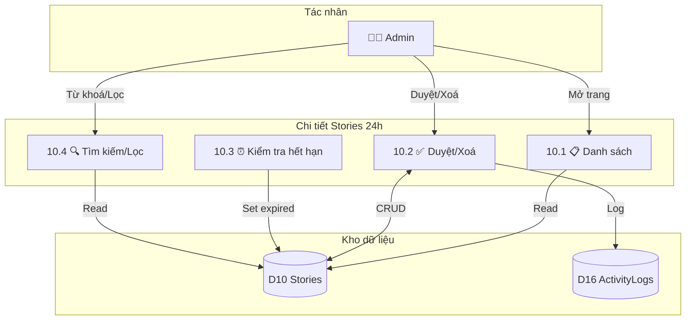

Ghi chú: xác định expired theo createdAt + 24h (server timestamp ưu tiên).

---

### 11.0 🪪 QL Chức vụ

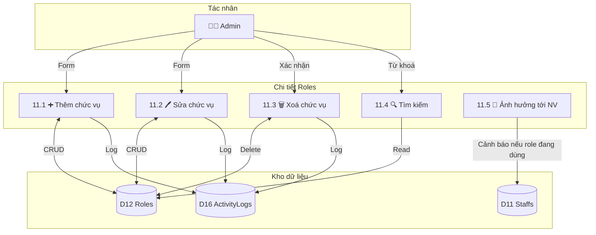

Ghi chú: cảnh báo khi role đang gán cho nhân viên; baseSalary có thể ảnh hưởng tính lương.

---

### 13.0 📤 Xuất/Báo cáo

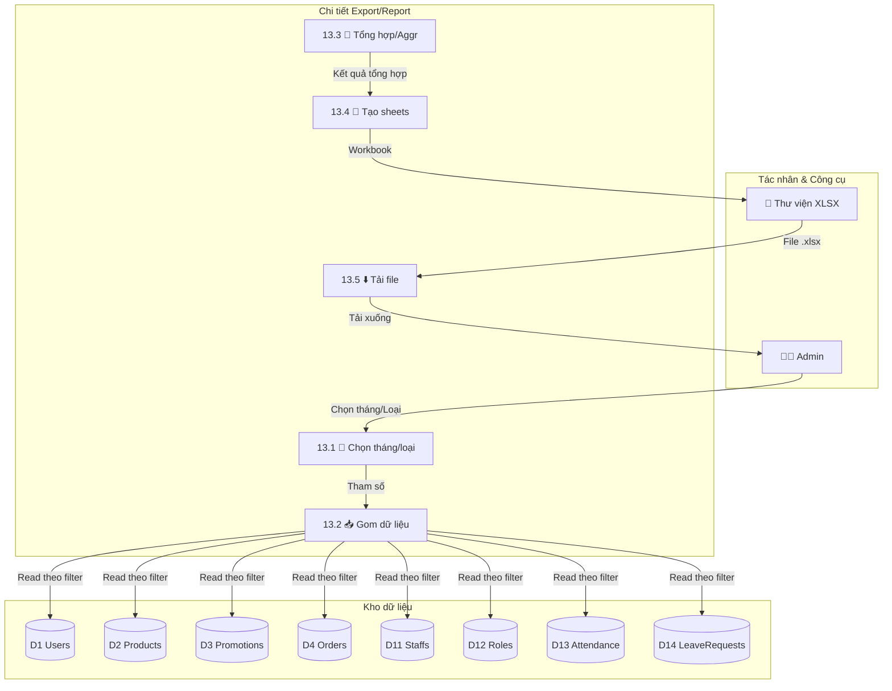

Ghi chú: chia sheet (Orders, Revenue, StaffHours…); định dạng tiền tệ; chỉ xuất trường cần thiết.

---

## 📚 Từ điển Dữ liệu (Data Dictionary)

### Luồng dữ liệu chính
| Tên luồng | Mô tả | Thành phần |
|---|---|---|
| Đăng nhập/Phân quyền | Kiểm tra phiên và quyền | uid, token, roleId |
| Chỉ số Dashboard | Gom số liệu hiển thị | counts, revenue[], status[] |
| CRUD Người dùng | Quản lý hồ sơ user | email, name, avatarUrl, address, roleId |
| CRUD Sản phẩm | Tạo/sửa/xoá sản phẩm | name, price, category, imageUrl, attributes |
| CRUD Khuyến mãi | Quản lý mã | code, discountPct, startDate, endDate, status |
| Đơn POS (cash) | Tạo đơn và in hoá đơn | items[], totals, cashGiven, change |
| Đơn POS (VNPay) | Tạo GD, nhận trạng thái | orderId, amount, txnStatus |
| Tin nhắn | Trao đổi với khách | sender, text, timestamp, read |
| Đánh giá | Quản trị review | rating, comment, orderId |
| CRUD Tin tức | Soạn Quill + ảnh | title, date, imageUrl, alt, summary, contentHtml |
| Tin 24h | Quản lý stories | content, imageUrl, createdAt, expiresAt |
| Chức vụ | Role & quyền | name, permissions, baseSalary |
| Nhân viên & Công | Hồ sơ, công, lương | staff, attendance, payroll |
| Xuất báo cáo | Tạo file Excel | sheets[], rows[] |

### Kho dữ liệu (tóm tắt)
| Kho | Mô tả | Trường chính |
|---|---|---|
| D1 Users | Người dùng | uid, email, name, avatarUrl, address, roleId |
| D2 Products | Sản phẩm | productId, name, price, category, imageUrl, attributes |
| D3 Promotions | Mã giảm giá | code, discountPct, startDate, endDate, status |
| D4 Orders | Đơn hàng | orderId, items[], status, paymentMethod, total, createdAt |
| D5 Messages | Tin nhắn | messageId, userId, sender, text, timestamp, read |
| D6 Reviews | Đánh giá | reviewId, userId, rating, comment, orderId |
| D7 Posts | Bài đăng MXH | postId, author, content, imageUrl, stats |
| D8 PostComments | Bình luận | commentId, postId, userId, text, parentId?, ts |
| D9 News | Tin tức | newsId, title, date, imageUrl, alt, summary, contentHtml |
| D10 Stories | Tin 24h | storyId, userId, imageUrl, text, createdAt, expiresAt |
| D11 Staffs | Nhân viên | staffId, email, name, phone, address, roleId, startDate, baseSalary, status, avatarUrl |
| D12 Roles | Chức vụ | roleId, name, permissions, baseSalary |
| D13 Attendance | Chấm công | staffId, yyyy-mm-dd, checkIn, checkOut, location? |
| D14 LeaveRequests | Nghỉ phép | requestId, staffId, type, fromDate, toDate, reason, status |
| D15 Notifications | Thông báo | notificationId, userId, type, content, read |
| D16 ActivityLogs | Nhật ký | logId, actor, action, target, ts |
| D17 Payments | Thanh toán | paymentId, orderId, method, amount, status, ts |

---

## 🧾 Quy tắc kinh doanh & Ràng buộc

### Bảo mật & Quyền hạn
- Chỉ admin/role phù hợp mới truy cập quản trị; ẩn module theo quyền.
- Firebase Rules: hạn chế đọc/ghi các node quản trị theo role; chỉ admin được phép upload lên Cloudinary (qua signed upload hoặc preset phù hợp).
- Ghi ActivityLogs cho thao tác nhạy cảm (xoá, đổi trạng thái đơn, sửa lương…).

### Đơn hàng & Thanh toán
- Không tính doanh thu cho đơn huỷ; không cho chuyển trạng thái ngược logic.
- VNPay: có timeout, xử lý thất bại; đảm bảo idempotent khi ghi thanh toán/đơn.
- POS tiền mặt: làm tròn tiền, tính tiền thối chính xác.

### Nhân sự & Lương
- Tính từ ngày bắt đầu; ngày hợp lệ có đủ vào/ra và ≥ 30 phút.
- Nghỉ có phép dựa trên đơn duyệt; nghỉ không phép trừ 5% lương cơ bản/ngày.
- Ngưỡng 392 giờ/tháng nhận full lương cơ bản; thấp hơn thì tính theo giờ.

### Nội dung & Dữ liệu
- Tin tức: nội dung Quill cần được "sanitize" trước khi lưu/hiển thị.
- Stories 24h: hết hạn sau 24h; dùng server timestamp để tránh lệch giờ.
- Sản phẩm: không xoá nếu đang gắn với đơn chưa tất toán (nếu áp chính sách).

---

## 🧪 Kịch bản luồng tiêu biểu

### Scenario 1: Tạo đơn POS (tiền mặt)
```
1) Admin chọn món → áp mã KM → tính tổng
2) Nhập tiền khách đưa → tính tiền thối
3) Ghi /orders (status=confirmed, method=cash) → ghi log
4) Mở modal bill → In hoá đơn → Cập nhật Dashboard
```

### Scenario 2: Thanh toán VNPay
```
1) Admin tạo order VNPay → hiển thị QR
2) Nhận callback/poll trạng thái → thành công
3) Ghi /payments, cập nhật /orders (paid) → ghi log
4) Hiển thị kết quả → thêm lịch sử đơn gần đây
```

### Scenario 3: Tính lương tháng
```
1) Chọn tháng → đọc /attendance, /staffs, /roles
2) Tính giờ hợp lệ theo quy tắc → tính lương giờ cơ bản
3) Áp nghỉ có phép/không phép → ra lương thực nhận
4) Hiển thị bảng lương → có nút xuất Excel
```

### Scenario 4: CRUD Tin tức
```
1) Soạn nội dung với Quill → upload ảnh → lấy URL
2) Lưu /news (title, date, alt, summary, contentHtml)
3) Hiển thị trong bảng tin tức → cho phép sửa/xoá
4) Tìm kiếm theo tiêu đề/ngày → lọc hiển thị
```

---

Sơ đồ DFD trên bao phủ đầy đủ các module quản trị: Auth, Dashboard, Người dùng, Sản phẩm, Mã giảm giá, Đơn hàng & POS (VNPay), Tin nhắn & Đánh giá, Bài đăng MXH, Tin tức, Tin 24h, Chức vụ, Nhân viên & Chấm công, Xuất báo cáo – bám sát thực thi trong AdminDashboard.html.

# DFD Hệ thống Quản trị Ấm - Coffee & Cake (Mức 0, 1, 2)

Tài liệu này mô tả luồng dữ liệu (Data Flow Diagram) cho trang quản trị `AdminDashboard.html` sử dụng Firebase (Auth + Realtime Database, kèm Cloudinary cho ảnh) và các thành phần giao diện (Chart.js, Quill, XLSX).

- Công nghệ chính: Firebase Auth, Realtime Database (RTDB), Chart.js, Quill, XLSX.
- Nguyên tắc: Chỉ Admin (hoặc người dùng có role phù hợp) được truy cập; mọi thay đổi ghi nhật ký hoạt động; dùng server timestamp khi ghi.

## Ký hiệu nhanh
- Tác nhân ngoài hệ thống: hình chữ nhật (Admin, Người dùng/Khách hàng, Cổng VNPay).
- Tiến trình: hình tròn/bộ xử lý (P.x).
- Kho dữ liệu: hai gạch song song (D.x) — ánh xạ RTDB.
- Luồng dữ liệu: mũi tên có nhãn dữ liệu.

## Ánh xạ kho dữ liệu (Firebase RTDB)
- D1 Users: `/users/{uid}`
- D2 Products: `/products/{productId}`
- D3 Promotions: `/promotions/{promotionId}`
- D4 Orders: `/orders/{orderId}`
- D5 Messages: `/messages/{userId}/{messageId}`
- D6 Reviews: `/reviews/{reviewId}` (hoặc `/reviews/{userId}/{reviewId}`)
- D7 Posts: `/posts/{postId}`
- D8 PostComments: `/postComments/{postId}/{commentId}`
- D9 News: `/news/{newsId}`
- D10 Stories (Tin 24h): `/stories/{storyId}`
- D11 Staffs: `/staffs/{staffId}`
- D12 Roles: `/roles/{roleId}`
- D13 Attendance: `/attendance/{staffId}/{yyyy-mm-dd}`
- D14 LeaveRequests: `/leaveRequests/{staffId}/{requestId}`
- D15 Notifications: `/notifications/{notificationId}` (hoặc phân loại)
- D16 ActivityLogs: `/adminLogs/{logId}`
- D17 Payments (nếu lưu): `/payments/{paymentId}`

Lưu trữ ảnh (ảnh sản phẩm, tin tức, avatar…): Cloudinary, DB lưu URL trả về.

---

## Level 0 — Sơ đồ ngữ cảnh (Context)

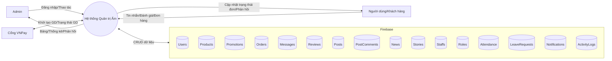

---

## Level 1 — Phân rã tiến trình chính

```mermaid
flowchart TB
  subgraph P0[(Hệ thống Quản trị Ấm)]
    P1[1. Auth & Phân quyền]
    P2[2. Dashboard Thống kê]
    P3[3. QL Người dùng]
    P4[4. QL Sản phẩm]
    P5[5. QL Mã giảm giá]
    P6[6. QL Đơn hàng & POS]
    P7[7. QL Tin nhắn & Đánh giá]
    P8[8. QL Bài đăng MXH]
    P9[9. QL Tin tức]
    P10[10. QL Tin 24h]
    P11[11. QL Chức vụ]
    P12[12. QL Nhân viên & Chấm công]
    P13[13. Xuất báo cáo]
  end

  Admin -->|Tác vụ| P1
  Admin -->|Xem| P2
  Admin -->|CRUD| P3
  Admin -->|CRUD| P4
  Admin -->|CRUD| P5
  Admin -->|CRUD/Thanh toán| P6
  Admin -->|Nhắn tin/duyệt| P7
  Admin -->|Moderate| P8
  Admin -->|CRUD| P9
  Admin -->|CRUD| P10
  Admin -->|CRUD| P11
  Admin -->|CRUD/Tính lương| P12
  Admin -->|Xuất file| P13

  P1 <-->|Đọc/ghi role| D1 & D12
  P2 -->|Đọc số liệu| D1&D2&D3&D4&D10&D15
  P3 <-->|CRUD| D1
  P4 <-->|CRUD| D2
  P5 <-->|CRUD| D3
  P6 <-->|CRUD| D4
  P7 <-->|CRUD| D5 & D6
  P8 <-->|CRUD| D7 & D8
  P9 <-->|CRUD| D9
  P10 <-->|CRUD| D10
  P11 <-->|CRUD| D12
  P12 <-->|CRUD| D11 & D13 & D14
  P13 -->|Tổng hợp| D1-D14
```

---

## Level 2 — Chi tiết luồng dữ liệu theo module

Mỗi tiểu mục liệt kê: Mục tiêu, Tiến trình con, Dữ liệu vào/ra, Kho dữ liệu, Quy tắc/ghi chú.

### 1) Auth & Phân quyền (P1)
- Tiến trình con:
  - P1.1 Kiểm tra phiên (onAuthStateChanged)
  - P1.2 Nạp thông tin role/quyền từ D1/D12
  - P1.3 Chặn truy cập, chuyển hướng đăng nhập
  - P1.4 Đăng xuất
- Vào: token Auth, uid
- Ra: Trạng thái phiên, quyền hiển thị module, tên admin
- Dữ liệu: D1 Users, D12 Roles
- Ghi chú: Chỉ hiển thị menu/section theo quyền; ghi ActivityLogs khi đăng nhập/đăng xuất.

### 2) Dashboard Thống kê (P2)
- Tiến trình con:
  - P2.1 Tổng hợp chỉ số nhanh (sản phẩm bán chạy, đơn đang giao, user, story đang hoạt động, mã khuyến mãi active)
  - P2.2 Biểu đồ doanh thu theo bộ lọc (12 tháng/tháng này/tuần này/hôm nay)
  - P2.3 Phân bổ trạng thái đơn hàng (pie/doughnut)
  - P2.4 Thông báo & hoạt động gần đây
- Vào: D2, D3, D4, D1, D10, D15, D16
- Ra: Số liệu hiển thị; datasets cho Chart.js
- Quy tắc: Không tính doanh thu cho đơn hủy; chuẩn hóa timezone; tránh N+1 khi tính best seller.

### 3) Quản lý Người dùng (P3)
- Tiến trình con: P3.1 Danh sách/ tìm kiếm; P3.2 Thêm; P3.3 Sửa; P3.4 Xóa
- Vào/Ra: biểu mẫu người dùng (email, name, avatarUrl, address, roleId)
- Kho: D1 Users
- Quy tắc: Email duy nhất; kiểm soát xóa (nếu user có đơn hàng/hóa đơn liên quan); cập nhật role đồng bộ.

### 4) Quản lý Sản phẩm (P4)
- Tiến trình con:
  - P4.1 Thêm sản phẩm (upload ảnh → Cloudinary, lưu URL vào D2)
  - P4.2 Sửa sản phẩm (cập nhật info/ảnh)
  - P4.3 Xóa sản phẩm
  - P4.4 Tìm kiếm/Lọc theo danh mục
- Dữ liệu vào: name, price, category, imageFile, attributes
- Ra: bản ghi sản phẩm (imageUrl)
- Kho: D2 Products (+ Cloudinary)
- Quy tắc: Validate giá > 0, danh mục hợp lệ; dọn ảnh cũ nếu thay ảnh.

### 5) Quản lý Mã giảm giá (P5)
- Tiến trình con: P5.1 Thêm; P5.2 Sửa; P5.3 Xóa; P5.4 Bật/tắt trạng thái; P5.5 Tìm kiếm
- Vào: code, discountPct(1–100), startDate, endDate, status
- Kho: D3 Promotions
- Quy tắc: Không trùng code; tự hết hạn theo ngày (client job khi load); đồng bộ với POS/checkout.

### 6) Quản lý Đơn hàng & POS (P6)
- Tiến trình con:
  - P6.1 Tạo order POS (cash): chọn item → tính tổng → nhận tiền → tính tiền thối → push D4 → render/in bill
  - P6.2 Tạo order POS (VNPay): khởi tạo GD → hiển thị QR → chờ xác nhận → cập nhật D4 + thanh toán
  - P6.3 Cập nhật trạng thái đơn (pending/confirmed/shipped/delivered/cancelled/pending-make)
  - P6.4 Xem chi tiết & lịch sử đơn gần nhất
  - P6.5 Bộ lọc, tìm kiếm theo ID/tên khách
- Dữ liệu vào: items[{productId, name, qty, price, note}], paymentMethod, cashGiven, notes
- Kho: D4 Orders, D3 Promotions (áp mã), D2 Products (thông tin giá), D17 Payments (nếu theo dõi), D16 Logs
- Quy tắc: Không cho chuyển trạng thái ngược logic; làm tròn tiền; timeout với VNPay; không tính doanh thu cho cancelled.

### 7) Quản lý Tin nhắn & Đánh giá (P7)
- Tiến trình con:
  - P7.1 Nạp danh sách hội thoại (panel trái), chọn user → nạp thread
  - P7.2 Gửi trả lời (admin) → push tin nhắn; đánh dấu đã đọc
  - P7.3 Tìm kiếm tin nhắn
  - P7.4 Quản lý đánh giá (list, duyệt/xóa nếu có)
- Dữ liệu: D5 Messages, D6 Reviews
- Quy tắc: Giới hạn 500 ký tự; lọc nội dung nhạy cảm; hiển thị thời gian & trạng thái đọc.

### 8) Quản lý Bài đăng MXH (P8)
- Tiến trình con: P8.1 Danh sách; P8.2 Xem chi tiết (modal); P8.3 Quản trị bình luận (xóa)
- Dữ liệu: D7 Posts, D8 PostComments
- Quy tắc: Phân trang bình luận; giữ chuỗi trả lời; log xóa bình luận.

### 9) Quản lý Tin tức (P9)
- Tiến trình con:
  - P9.1 Thêm tin: soạn với Quill → upload ảnh → lưu D9 (title, date, imageUrl, alt, summary, contentHtml)
  - P9.2 Sửa tin; P9.3 Xóa tin; P9.4 Tìm kiếm
- Kho: D9 News (+ Cloudinary)
- Quy tắc: Sanitization nội dung HTML; alt bắt buộc; ngày hợp lệ.

### 10) Quản lý Tin 24h (P10)
- Tiến trình con: P10.1 Danh sách; P10.2 Duyệt/Xóa; P10.3 Xác định trạng thái (active/expired)
- Kho: D10 Stories
- Quy tắc: Hết hạn sau 24h từ createdAt; dọn story cũ; lệch giờ → ưu tiên server timestamp.

### 11) Quản lý Chức vụ (Roles) (P11)
- Tiến trình con: P11.1 Thêm; P11.2 Sửa; P11.3 Xóa; P11.4 Tìm kiếm
- Dữ liệu: name, description, permissions, baseSalary
- Kho: D12 Roles
- Quy tắc: Nếu role đang được staff sử dụng, cảnh báo khi xóa/sửa; propagate lương cơ bản mặc định.

### 12) Quản lý Nhân viên & Chấm công (P12)
- Tiến trình con:
  - P12.1 Thêm/Sửa nhân viên (chọn từ members hoặc nhập mới, upload avatar)
  - P12.2 Tổng quan: tổng NV, đang làm việc, tổng lương tháng, tổng ngày nghỉ
  - P12.3 Chấm công: tổng hợp giờ/ca theo ngày từ D13
  - P12.4 Tính lương tháng theo quy tắc hiển thị trên UI
  - P12.5 Yêu cầu nghỉ phép: duyệt/từ chối (D14)
  - P12.6 Xem chi tiết nhân viên (modal fullscreen: info, công, lương, yêu cầu)
- Dữ liệu: D11 Staffs, D13 Attendance, D14 LeaveRequests, D12 Roles
- Quy tắc tính lương (tóm tắt):
  - Chỉ tính từ ngày bắt đầu làm việc; ngày có đủ check-in/out và ≥ 30 phút
  - Nghỉ có phép: cộng vào thống kê nghỉ có phép; nghỉ không phép: trừ 5% lương cơ bản/ngày
  - ≥ 392 giờ/tháng: nhận full lương cơ bản; < 392 giờ: giờ thực tế × lương giờ cơ bản
  - Lương giờ cơ bản = Lương tháng ÷ (28×14), làm tròn chuẩn

### 13) Xuất báo cáo (P13)
- Tiến trình con:
  - P13.1 Xuất báo cáo tháng (Excel): chọn tháng → tổng hợp orders, revenue, top items, v.v.
  - P13.2 Xuất báo cáo nhân sự (Excel): tổng hợp công, lương, nghỉ phép
- Dữ liệu: D1–D14 tùy báo cáo; xuất qua XLSX
- Quy tắc: Chia sheet theo chủ đề; định dạng tiền tệ; bảo vệ dữ liệu nhạy cảm.

---

## Ma trận CRUD nhanh theo kho dữ liệu
- D1 Users: P1(R), P3(CRUD), P11/P12(R) — gán role
- D2 Products: P4(CRUD), P6(R)
- D3 Promotions: P5(CRUD), P6(R)
- D4 Orders: P6(CRUD), P2(R)
- D5 Messages: P7(CRUD)
- D6 Reviews: P7(CRUD)
- D7 Posts: P8(CRUD)
- D8 PostComments: P8(CRUD)
- D9 News: P9(CRUD)
- D10 Stories: P10(CRUD)
- D11 Staffs: P12(CRUD)
- D12 Roles: P1/P11/P12(CRUD)
- D13 Attendance: P12(CRUD)
- D14 LeaveRequests: P12(CRUD)
- D15 Notifications: P2(CRUD)
- D16 ActivityLogs: tất cả module ghi Log (C), P2/P13 đọc

---

## Luồng mẫu chi tiết (ví dụ) — Tạo đơn POS (P6.1/P6.2)
1) Admin chọn món & số lượng → Tạm tính tổng → Áp mã giảm giá (đọc D3) → Tổng tiền
2a) Cash: nhập tiền khách → tính tiền thối → tạo bản ghi /orders (D4) với paymentMethod=cash, status=confirmed → mở modal bill → In
2b) VNPay: khởi tạo GD với VNPay → hiển thị QR → polling/trả về trạng thái → nếu thành công: ghi /orders (D4), /payments (D17, nếu có); nếu thất bại: hiển thị lỗi
3) Ghi /adminLogs (D16), cập nhật Dashboard

---

## Bảo mật & quy tắc Firebase Rules (gợi ý)
- Chỉ uid có role admin mới có quyền đọc/ghi các node quản trị (products, promotions, orders, news, stories, staffs, roles, attendance, leaveRequests, messages,…)
- Ảnh: chỉ admin được phép upload; dùng Cloudinary preset/signed để kiểm soát; xác thực kích thước/loại file phía client.
- Ghi log thao tác quan trọng (xóa/sửa lương/duyệt nghỉ/đổi trạng thái đơn).

## Ghi chú triển khai
- Dùng server timestamp khi set/update: tránh lệch múi giờ khi tính 24h cho stories và thống kê doanh thu.
- Batch đọc/ghi hợp lý; hạn chế listener onValue diện rộng; phân trang nếu dữ liệu lớn.
- Sanitization nội dung HTML từ Quill trước khi lưu.

--

Tài liệu này bao phủ các module trong AdminDashboard.html: Auth, Dashboard, QL Người dùng, QL Sản phẩm, QL Mã giảm giá, QL Đơn hàng & POS & VNPay & In bill, QL Tin nhắn & Đánh giá, QL Bài đăng MXH, QL Tin tức, QL Tin 24h, QL Chức vụ, QL Nhân viên & Chấm công, Xuất báo cáo. Có thể kết hợp với các file DFD-* hiện có để chi tiết hơn từng miền chức năng.
