# MÔ TẢ USE CASE - HỆ THỐNG WEBSITE THƯƠNG MẠI ĐIỆN TỬ AM COFFEE AND CAKE

## 1. USE CASE QUẢN LÝ TÀI KHOẢN

### UC001: Đăng nhập
**Actor:** Khách vãng lai, Người dùng, Nhân viên, Admin
**Mô tả:** Người dùng đăng nhập vào hệ thống bằng google hoặc email và mật khẩu
**Precondition:** Người dùng chưa đăng nhập
**Main Flow:**
1. Người dùng truy cập trang đăng nhập
2. Nhập email và mật khẩu hoặc ấn đăng nhập google
3. Hệ thống xác thực thông tin
4. Nếu thành công, chuyển hướng đến trang chủ, AdminDashboard, dashboard-timesheet
5. Nếu thất bại, hiển thị thông báo lỗi
**Postcondition:** Đã đăng nhập thành công
**Exception:** Thông tin đăng nhập không chính xác

### UC002: Đăng ký
**Actor:** Khách vãng lai
**Mô tả:** Khách hàng tạo tài khoản mới trong hệ thống
**Precondition:** Chưa có tài khoản
**Main Flow:**
1. Người dùng truy cập trang đăng ký
2. Nhập thông tin cá nhân (họ tên, email, mật khẩu)
3. Xác nhận mật khẩu
4. Đồng ý với điều khoản sử dụng
5. Hệ thống gửi email xác thực
6. Người dùng xác thực email
7. Tài khoản được kích hoạt
**Postcondition:** Tài khoản mới được tạo thành công
**Exception:** Email đã tồn tại, thông tin không hợp lệ

### UC003: Quên mật khẩu
**Actor:** Người dùng, nhân viên
**Mô tả:** Người dùng, nhân viên yêu cầu đặt lại mật khẩu khi quên
**Precondition:** Có tài khoản trong hệ thống
**Main Flow:**
1. Người dùng, nhân viên chọn "Quên mật khẩu"
2. Nhập email đã đăng ký
3. Hệ thống gửi link đặt lại mật khẩu qua email
4. Người dùng click vào link
5. Nhập mật khẩu mới
6. Xác nhận mật khẩu mới
7. Cập nhật mật khẩu thành công
**Postcondition:** Mật khẩu được đặt lại thành công
**Exception:** Email không tồn tại, link hết hạn

### UC004: Đăng xuất
**Actor:** Người dùng, admin, nhân viên
**Mô tả:** Người dùng, admin, nhân viên đăng xuất khỏi hệ thống
**Precondition:** Người dùng đã đăng nhập
**Main Flow:**
1. Người dùng chọn "Đăng xuất"
2. Hệ thống xóa session
3. Chuyển hướng về trang chủ
**Postcondition:** Người dùng đã đăng xuất thành công

### UC005: Quản lý hồ sơ cá nhân
**Actor:** Người dùng
**Mô tả:** Người dùng cập nhật thông tin cá nhân
**Precondition:** Đã đăng nhập
**Main Flow:**
1. Truy cập trang hồ sơ cá nhân
2. Xem thông tin hiện tại
3. Chỉnh sửa thông tin (họ tên, số điện thoại, địa chỉ)
4. Upload ảnh đại diện (tùy chọn)
5. Lưu thay đổi
**Postcondition:** Thông tin cá nhân được cập nhật
**Exception:** Thông tin không hợp lệ

## 2. USE CASE THÔNG TIN VÀ ĐIỀU HƯỚNG

### UC006: Xem trang chủ
**Actor:** Khách vãng lai, Người dùng
**Mô tả:** Hiển thị trang chủ với thông tin tổng quan
**Precondition:** Không
**Main Flow:**
1. Truy cập trang chủ
2. Hiển thị banner quảng cáo
3. Hiển thị sản phẩm nổi bật
4. Hiển thị tin tức mới nhất
5. Hiển thị thông tin liên hệ
**Postcondition:** Trang chủ được hiển thị thành công

### UC007: Xem menu
**Actor:** Khách vãng lai, Người dùng
**Mô tả:** Xem danh sách sản phẩm theo danh mục
**Precondition:** Không
**Main Flow:**
1. Truy cập trang menu
2. Chọn danh mục sản phẩm
3. Hiển thị danh sách sản phẩm
4. Xem chi tiết sản phẩm (tùy chọn)
**Postcondition:** Menu được hiển thị thành công

### UC008: Xem chính sách
**Actor:** Khách vãng lai, Người dùng
**Mô tả:** Xem các chính sách của cửa hàng
**Precondition:** Không
**Main Flow:**
1. Truy cập trang chính sách
2. Chọn loại chính sách (đổi trả, bảo mật, vận chuyển)
3. Đọc nội dung chính sách
**Postcondition:** Chính sách được hiển thị

### UC009: Xem sự kiện
**Actor:** Khách vãng lai, Người dùng
**Mô tả:** Xem các sự kiện và khuyến mãi
**Precondition:** Không
**Main Flow:**
1. Truy cập trang sự kiện
2. Xem danh sách sự kiện đang diễn ra
3. Xem chi tiết sự kiện
4. Tham gia sự kiện (nếu đã đăng nhập)
**Postcondition:** Thông tin sự kiện được hiển thị

### UC010: Xem tin tức
**Actor:** Khách vãng lai, Người dùng
**Mô tả:** Xem tin tức và bài viết
**Precondition:** Không
**Main Flow:**
1. Truy cập trang tin tức
2. Xem danh sách tin tức
3. Đọc chi tiết tin tức
4. Bình luận (nếu đã đăng nhập)
**Postcondition:** Tin tức được hiển thị

## 3. USE CASE MUA SẮM VÀ ĐƠN HÀNG

### UC011: Tìm kiếm sản phẩm
**Actor:** Khách vãng lai, Người dùng
**Mô tả:** Tìm kiếm sản phẩm theo từ khóa
**Precondition:** Không
**Main Flow:**
1. Nhập từ khóa tìm kiếm
2. Chọn bộ lọc (giá, danh mục, đánh giá)
3. Hệ thống hiển thị kết quả tìm kiếm
4. Xem chi tiết sản phẩm
**Postcondition:** Kết quả tìm kiếm được hiển thị
**Exception:** Không tìm thấy sản phẩm

### UC012: Thêm vào giỏ hàng
**Actor:** Người dùng
**Mô tả:** Thêm sản phẩm vào giỏ hàng
**Precondition:** Đã đăng nhập
**Main Flow:**
1. Chọn sản phẩm
2. Chọn số lượng
3. Chọn tùy chọn (nếu có)
4. Thêm vào giỏ hàng
5. Hiển thị thông báo thành công
**Postcondition:** Sản phẩm được thêm vào giỏ hàng
**Exception:** Sản phẩm hết hàng

### UC013: Thanh toán
**Actor:** Người dùng
**Mô tả:** Thực hiện thanh toán đơn hàng
**Precondition:** Có sản phẩm trong giỏ hàng
**Main Flow:**
1. Xem giỏ hàng
2. Kiểm tra thông tin giao hàng
3. Chọn phương thức thanh toán
4. Nhập mã giảm giá 
5. Xác nhận đơn hàng
6. Chuyển hướng đến cổng thanh toán VNPay
7. Hoàn tất thanh toán
8. Nhận xác nhận đơn hàng
**Postcondition:** Đơn hàng được tạo thành công
**Exception:** Thanh toán thất bại, hết hàng

### UC014: Xem lịch sử đơn hàng
**Actor:** Người dùng
**Mô tả:** Xem danh sách đơn hàng đã đặt
**Precondition:** Đã đăng nhập
**Main Flow:**
1. Truy cập trang lịch sử đơn hàng
2. Xem danh sách đơn hàng
3. Xem chi tiết đơn hàng
4. Đánh giá sản phẩm (nếu đã nhận hàng)
**Postcondition:** Lịch sử đơn hàng được hiển thị

### UC015: Xem điểm tích lũy
**Actor:** Người dùng
**Mô tả:** Xem điểm tích lũy và lịch sử giao dịch
**Precondition:** Đã đăng nhập
**Main Flow:**
1. Truy cập trang điểm tích lũy
2. Xem tổng điểm hiện tại
3. Xem lịch sử tích lũy
4. Xem cách sử dụng điểm
**Postcondition:** Thông tin điểm tích lũy được hiển thị

## 4. USE CASE GIAO TIẾP VÀ MẠNG XÃ HỘI

### UC016: Chat real-time
**Actor:** Người dùng
**Mô tả:** Trò chuyện trực tuyến với nhân viên hỗ trợ
**Precondition:** Đã đăng nhập
**Main Flow:**
1. Mở chat window
2. Gửi tin nhắn
3. Nhận phản hồi từ     
4. Gửi file/hình ảnh (nếu cần)
**Postcondition:** Cuộc trò chuyện được thực hiện
**Exception:** Không có nhân viên online

### UC017: Chat tư vấn AI
**Actor:** Người dùng
**Mô tả:** Trò chuyện với chatbot AI để được tư vấn
**Precondition:** Đã đăng nhập
**Main Flow:**
1. Mở chat AI
2. Đặt câu hỏi
3. Nhận phản hồi từ AI
4. Tiếp tục trò chuyện
**Postcondition:** Tư vấn AI được thực hiện
**Exception:** Hệ thống AI gặp sự cố

### UC018: Đăng bài mạng xã hội
**Actor:** Người dùng
**Mô tả:** Đăng bài viết lên mạng xã hội nội bộ
**Precondition:** Đã đăng nhập
**Main Flow:**
1. Truy cập trang mạng xã hội
2. Tạo bài viết mới
3. Thêm nội dung và hình ảnh
4. Chọn quyền riêng tư
5. Đăng bài
**Postcondition:** Bài viết được đăng thành công
**Exception:** Nội dung vi phạm quy định

### UC019: Tương tác bài viết MXH
**Actor:** Người dùng
**Mô tả:** Thích, bình luận, chia sẻ bài viết
**Precondition:** Đã đăng nhập
**Main Flow:**
1. Xem bài viết
2. Thực hiện hành động (thích/bình luận/chia sẻ)
3. Nhận thông báo phản hồi
**Postcondition:** Tương tác được thực hiện thành công

### UC020: Kết bạn MXH
**Actor:** Người dùng
**Mô tả:** Gửi và chấp nhận lời mời kết bạn
**Precondition:** Đã đăng nhập
**Main Flow:**
1. Tìm kiếm người dùng
2. Gửi lời mời kết bạn
3. Người nhận xem lời mời
4. Chấp nhận/từ chối lời mời
**Postcondition:** Kết nối bạn bè được thiết lập
**Exception:** Người dùng không tồn tại

### UC021: Voice/Video call
**Actor:** Người dùng
**Mô tả:** Thực hiện cuộc gọi âm thanh/hình ảnh
**Precondition:** Đã đăng nhập, có kết nối internet
**Main Flow:**
1. Chọn người gọi
2. Chọn loại cuộc gọi (voice/video)
3. Thiết lập kết nối WebRTC
4. Thực hiện cuộc gọi
5. Kết thúc cuộc gọi
**Postcondition:** Cuộc gọi được thực hiện thành công
**Exception:** Kết nối mạng không ổn định

## 5. USE CASE QUẢN TRỊ HỆ THỐNG (ADMIN)

### UC022: Xem dashboard thống kê
**Actor:** Admin
**Mô tả:** Xem tổng quan thống kê hệ thống
**Precondition:** Đã đăng nhập với quyền admin
**Main Flow:**
1. Truy cập dashboard
2. Xem thống kê doanh thu
3. Xem thống kê đơn hàng
4. Xem thống kê người dùng
5. Xem biểu đồ phân tích
**Postcondition:** Dashboard được hiển thị

### UC023: Quản lý người dùng
**Actor:** Admin
**Mô tả:** Quản lý danh sách người dùng hệ thống
**Precondition:** Đã đăng nhập với quyền admin
**Main Flow:**
1. Xem danh sách người dùng
2. Tìm kiếm người dùng
3. Xem chi tiết người dùng
4. Khóa/mở khóa tài khoản
5. Xóa tài khoản (nếu cần)
**Postcondition:** Quản lý người dùng thành công

### UC024: Quản lý sản phẩm
**Actor:** Admin
**Mô tả:** Thêm, sửa, xóa sản phẩm
**Precondition:** Đã đăng nhập với quyền admin
**Main Flow:**
1. Xem danh sách sản phẩm
2. Thêm sản phẩm mới
3. Chỉnh sửa thông tin sản phẩm
4. Upload hình ảnh sản phẩm
5. Cập nhật giá và số lượng
6. Xóa sản phẩm (nếu cần)
**Postcondition:** Quản lý sản phẩm thành công

### UC025: Quản lý đơn hàng
**Actor:** Admin
**Mô tả:** Xử lý và quản lý đơn hàng
**Precondition:** Đã đăng nhập với quyền admin
**Main Flow:**
1. Xem danh sách đơn hàng
2. Xem chi tiết đơn hàng
3. Cập nhật trạng thái đơn hàng
4. Xác nhận thanh toán
5. Giao hàng
**Postcondition:** Quản lý đơn hàng thành công

### UC026: Quản lý mã giảm giá
**Actor:** Admin
**Mô tả:** Tạo và quản lý mã giảm giá
**Precondition:** Đã đăng nhập với quyền admin
**Main Flow:**
1. Xem danh sách mã giảm giá
2. Tạo mã giảm giá mới
3. Thiết lập điều kiện sử dụng
4. Thiết lập thời gian hiệu lực
5. Xóa mã giảm giá (nếu cần)
**Postcondition:** Quản lý mã giảm giá thành công

### UC027: Xuất báo cáo thống kê
**Actor:** Admin
**Mô tả:** Xuất báo cáo thống kê định kỳ
**Precondition:** Đã đăng nhập với quyền admin
**Main Flow:**
1. Chọn loại báo cáo
2. Chọn khoảng thời gian
3. Chọn định dạng xuất (PDF/Excel)
4. Tạo báo cáo
5. Tải xuống báo cáo
**Postcondition:** Báo cáo được xuất thành công

## 6. USE CASE TÍCH HỢP BÊN NGOÀI

### UC028: Thanh toán VNPay
**Actor:** Người dùng, VNPay
**Mô tả:** Tích hợp thanh toán qua VNPay
**Precondition:** Có đơn hàng cần thanh toán
**Main Flow:**
1. Chọn thanh toán qua VNPay
2. Chuyển hướng đến cổng VNPay
3. Nhập thông tin thẻ
4. Xác thực thanh toán
5. Nhận kết quả thanh toán
6. Quay về website
**Postcondition:** Thanh toán hoàn tất
**Exception:** Thanh toán thất bại

### UC029: Tích hợp AI Chat
**Actor:** Người dùng, tudongchat.com
**Mô tả:** Tích hợp chat AI từ dịch vụ bên ngoài
**Precondition:** Đã đăng nhập
**Main Flow:**
1. Mở chat AI
2. Kết nối với tudongchat.com
3. Gửi câu hỏi
4. Nhận phản hồi từ AI
**Postcondition:** Chat AI hoạt động bình thường
**Exception:** Dịch vụ AI không khả dụng

### UC030: WebRTC Communication
**Actor:** Người dùng, WebRTC
**Mô tả:** Tích hợp giao tiếp real-time qua WebRTC
**Precondition:** Đã đăng nhập, có camera/microphone
**Main Flow:**
1. Khởi tạo kết nối WebRTC
2. Thiết lập media stream
3. Thực hiện cuộc gọi
4. Xử lý tín hiệu âm thanh/hình ảnh
5. Kết thúc cuộc gọi
**Postcondition:** Giao tiếp WebRTC thành công
**Exception:** Thiết bị không hỗ trợ, mạng không ổn định

## 7. USE CASE QUẢN LÝ NHÂN SỰ VÀ CHẤM CÔNG

### UC031: Quản lý chức vụ
**Actor:** Admin
**Mô tả:** Thêm, sửa, xóa chức vụ trong hệ thống
**Precondition:** Đã đăng nhập với quyền admin
**Main Flow:**
1. Xem danh sách chức vụ
2. Thêm chức vụ mới
3. Sửa thông tin chức vụ
4. Xóa chức vụ (nếu cần)
**Postcondition:** Danh sách chức vụ được cập nhật

### UC032: Quản lý nhân viên
**Actor:** Admin
**Mô tả:** Thêm, sửa, xóa thông tin nhân viên
**Precondition:** Đã đăng nhập với quyền admin
**Main Flow:**
1. Xem danh sách nhân viên
2. Thêm nhân viên mới
3. Sửa thông tin nhân viên
4. Xóa nhân viên (nếu cần)
**Postcondition:** Danh sách nhân viên được cập nhật

### UC033: Quản lý chấm công
**Actor:** Admin
**Mô tả:** Quản lý dữ liệu chấm công của nhân viên
**Precondition:** Đã đăng nhập với quyền admin
**Main Flow:**
1. Xem bảng chấm công
2. Xác nhận hoặc chỉnh sửa dữ liệu chấm công
3. Xuất báo cáo chấm công
**Postcondition:** Dữ liệu chấm công được quản lý

### UC034: Xem thông tin cá nhân (Nhân viên)
**Actor:** Nhân viên
**Mô tả:** Nhân viên xem thông tin cá nhân của mình
**Precondition:** Đã đăng nhập
**Main Flow:**
1. Truy cập trang hồ sơ cá nhân
2. Xem thông tin cá nhân
**Postcondition:** Thông tin cá nhân được hiển thị

### UC035: Xem thông tin công việc (Nhân viên)
**Actor:** Nhân viên
**Mô tả:** Nhân viên xem thông tin công việc của mình
**Precondition:** Đã đăng nhập
**Main Flow:**
1. Truy cập trang thông tin công việc
2. Xem vị trí, ca làm, lịch làm việc
**Postcondition:** Thông tin công việc được hiển thị

### UC036: Chấm công vào
**Actor:** Nhân viên
**Mô tả:** Nhân viên thực hiện chấm công vào ca làm
**Precondition:** Đã đăng nhập
**Main Flow:**
1. Truy cập chức năng chấm công
2. Chọn "Chấm công vào"
3. Hệ thống ghi nhận thời gian vào
**Postcondition:** Thời gian vào được lưu lại

### UC037: Chấm công ra
**Actor:** Nhân viên
**Mô tả:** Nhân viên thực hiện chấm công ra khỏi ca làm
**Precondition:** Đã đăng nhập, đã chấm công vào
**Main Flow:**
1. Truy cập chức năng chấm công
2. Chọn "Chấm công ra"
3. Hệ thống ghi nhận thời gian ra
**Postcondition:** Thời gian ra được lưu lại

### UC038: Xin nghỉ phép
**Actor:** Nhân viên
**Mô tả:** Nhân viên gửi yêu cầu nghỉ phép
**Precondition:** Đã đăng nhập
**Main Flow:**
1. Truy cập chức năng xin nghỉ phép
2. Nhập thông tin ngày nghỉ, lý do
3. Gửi yêu cầu
4. Quản lý duyệt hoặc từ chối
**Postcondition:** Yêu cầu nghỉ phép được xử lý

### UC039: Thêm tăng ca
**Actor:** Nhân viên
**Mô tả:** Nhân viên đăng ký làm thêm giờ
**Precondition:** Đã đăng nhập
**Main Flow:**
1. Truy cập chức năng đăng ký tăng ca
2. Nhập thông tin ca tăng ca
3. Gửi yêu cầu
4. Quản lý duyệt hoặc từ chối
**Postcondition:** Yêu cầu tăng ca được xử lý

### UC040: Xem thông báo (Nhân viên)
**Actor:** Nhân viên
**Mô tả:** Nhân viên xem các thông báo từ hệ thống/quản lý
**Precondition:** Đã đăng nhập
**Main Flow:**
1. Truy cập trang thông báo
2. Xem danh sách thông báo
3. Đọc chi tiết thông báo
**Postcondition:** Thông báo được hiển thị

### UC041: Xem tình hình nhân sự
**Actor:** Nhân viên
**Mô tả:** Nhân viên xem tổng quan tình hình nhân sự (số lượng, ca làm, vắng mặt, ...)
**Precondition:** Đã đăng nhập
**Main Flow:**
1. Truy cập trang tổng quan nhân sự
2. Xem các thông tin tổng hợp
**Postcondition:** Thông tin nhân sự được hiển thị

### UC042: Xem thống kê (Nhân viên)
**Actor:** Nhân viên
**Mô tả:** Nhân viên xem thống kê về công việc, chấm công, tăng ca, nghỉ phép của bản thân
**Precondition:** Đã đăng nhập
**Main Flow:**
1. Truy cập trang thống kê cá nhân
2. Xem các số liệu thống kê
**Postcondition:** Thống kê cá nhân được hiển thị

---

## Sequence Diagram UC001: Đăng nhập (Firebase)

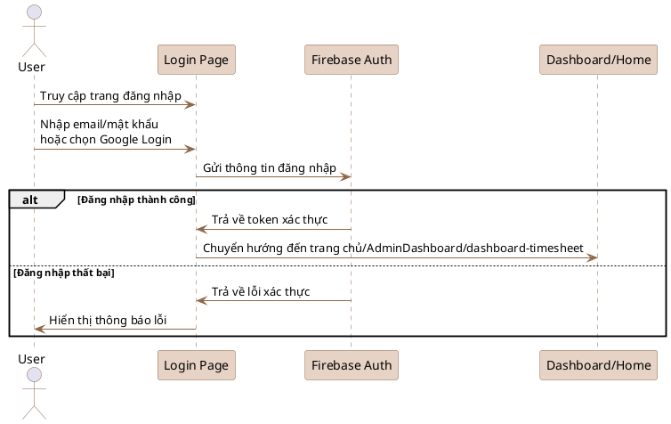
- **Lưu ý:** Sử dụng [PlantUML](https://plantuml.com/sequence-diagram) để render sơ đồ này.

---

## Sequence Diagram UC002: Đăng ký (Firebase)

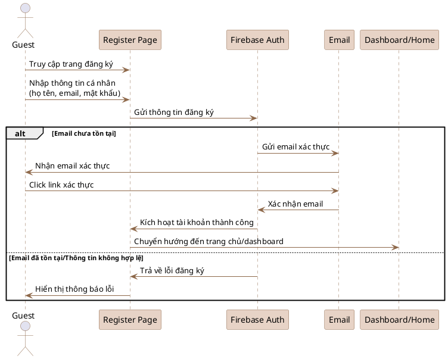
- **Lưu ý:** Sử dụng [PlantUML](https://plantuml.com/sequence-diagram) để render sơ đồ này.

---

## Sequence Diagram UC003: Quên mật khẩu (Firebase)

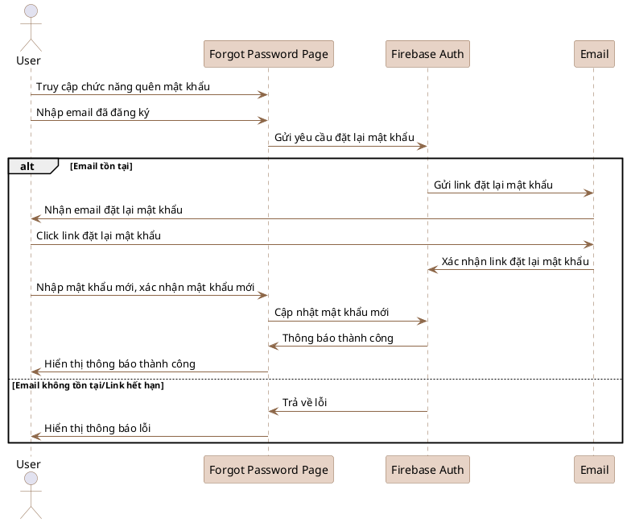
- **Lưu ý:** Sử dụng [PlantUML](https://plantuml.com/sequence-diagram) để render sơ đồ này.

---

## Sequence Diagram UC004: Đăng xuất (Firebase)

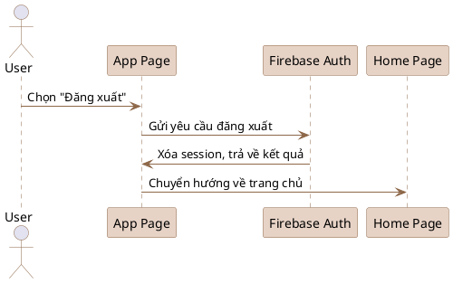
- **Lưu ý:** Sử dụng [PlantUML](https://plantuml.com/sequence-diagram) để render sơ đồ này.

---

## Sequence Diagram UC005: Quản lý hồ sơ cá nhân (Firebase)

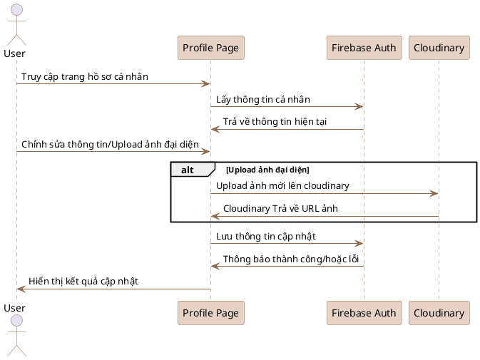
- **Lưu ý:** Sử dụng [PlantUML](https://plantuml.com/sequence-diagram) để render sơ đồ này.

---

## Sequence Diagram UC006: Xem trang chủ

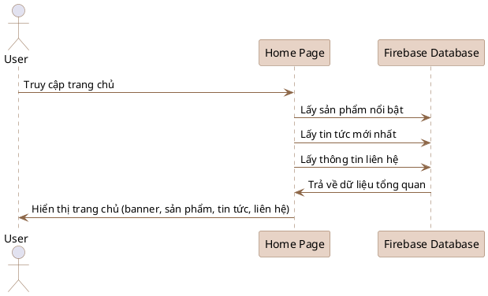
- **Lưu ý:** Sử dụng [PlantUML](https://plantuml.com/sequence-diagram) để render sơ đồ này.

---

## Sequence Diagram UC007: Xem menu

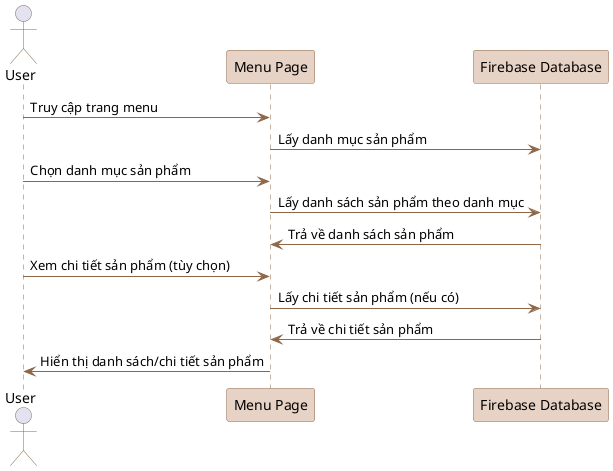
- **Lưu ý:** Sử dụng [PlantUML](https://plantuml.com/sequence-diagram) để render sơ đồ này.

---

## Sequence Diagram UC008: Xem chính sách

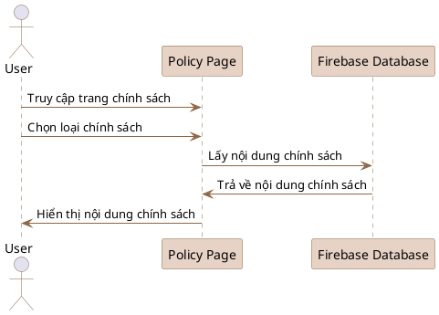
- **Lưu ý:** Sử dụng [PlantUML](https://plantuml.com/sequence-diagram) để render sơ đồ này.

---

## Sequence Diagram UC009: Xem sự kiện

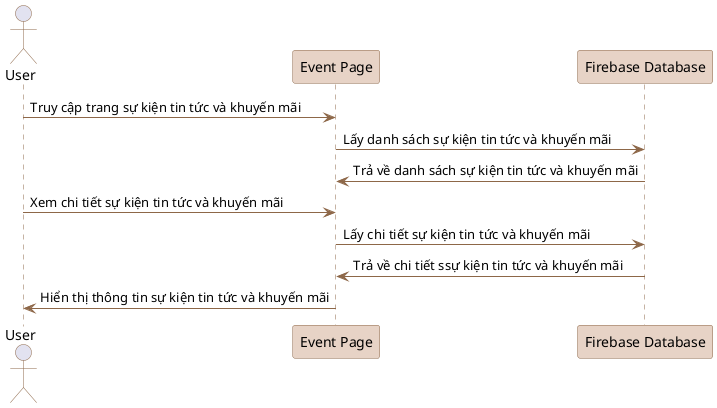
- **Lưu ý:** Sử dụng [PlantUML](https://plantuml.com/sequence-diagram) để render sơ đồ này.

---

## Sequence Diagram UC010: Xem tin tức

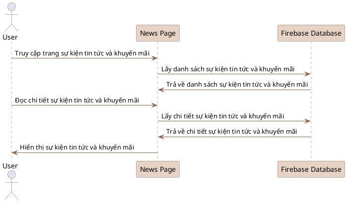
- **Lưu ý:** Sử dụng [PlantUML](https://plantuml.com/sequence-diagram) để render sơ đồ này.

---

## Sequence Diagram UC011: Tìm kiếm sản phẩm

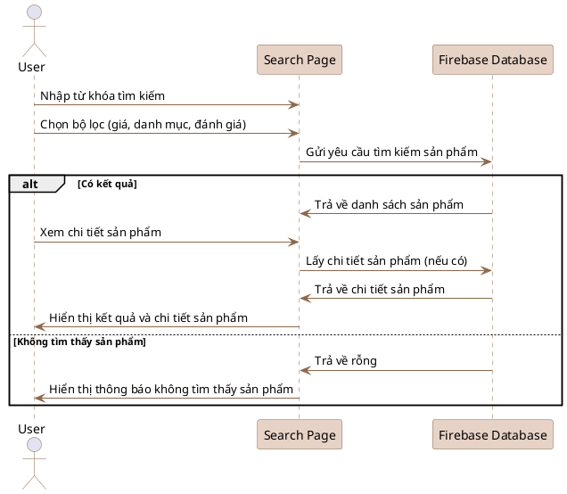
- **Lưu ý:** Sử dụng [PlantUML](https://plantuml.com/sequence-diagram) để render sơ đồ này.

---

## Sequence Diagram UC012: Thêm vào giỏ hàng

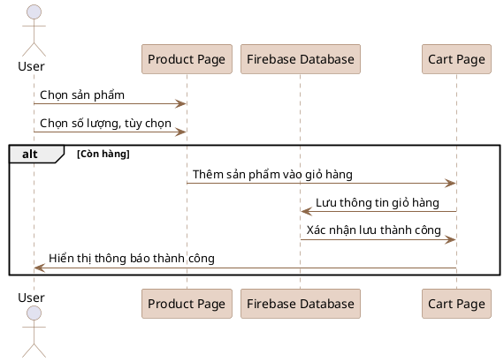
- **Lưu ý:** Sử dụng [PlantUML](https://plantuml.com/sequence-diagram) để render sơ đồ này.

---

## Sequence Diagram UC013: Thanh toán

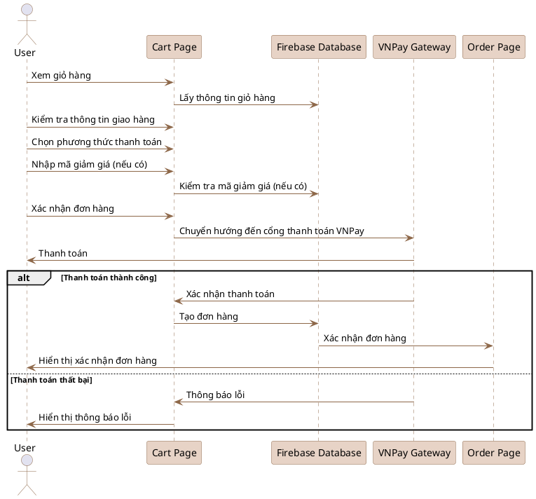
- **Lưu ý:** Sử dụng [PlantUML](https://plantuml.com/sequence-diagram) để render sơ đồ này.

---

## Sequence Diagram UC014: Xem lịch sử đơn hàng

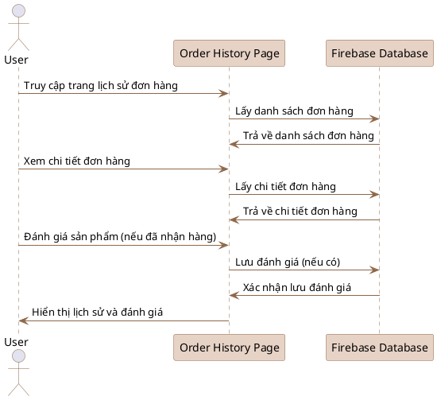
- **Lưu ý:** Sử dụng [PlantUML](https://plantuml.com/sequence-diagram) để render sơ đồ này.

---

## Sequence Diagram UC015: Xem điểm tích lũy

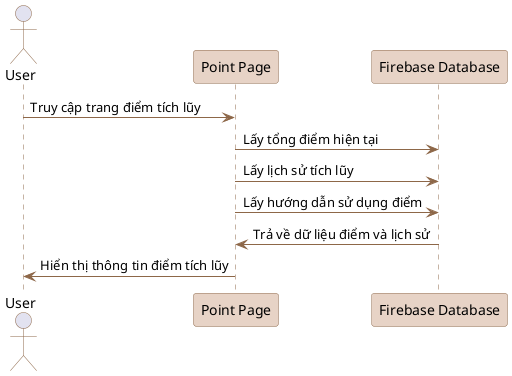
- **Lưu ý:** Sử dụng [PlantUML](https://plantuml.com/sequence-diagram) để render sơ đồ này.

---

## Sequence Diagram UC016: Chat real-time

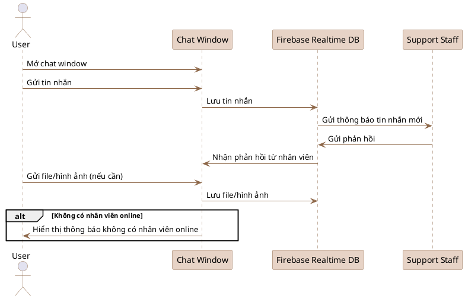
- **Lưu ý:** Sử dụng [PlantUML](https://plantuml.com/sequence-diagram) để render sơ đồ này.

---

## Sequence Diagram UC017: Box chat trực tiếp với quản trị viên CSKH

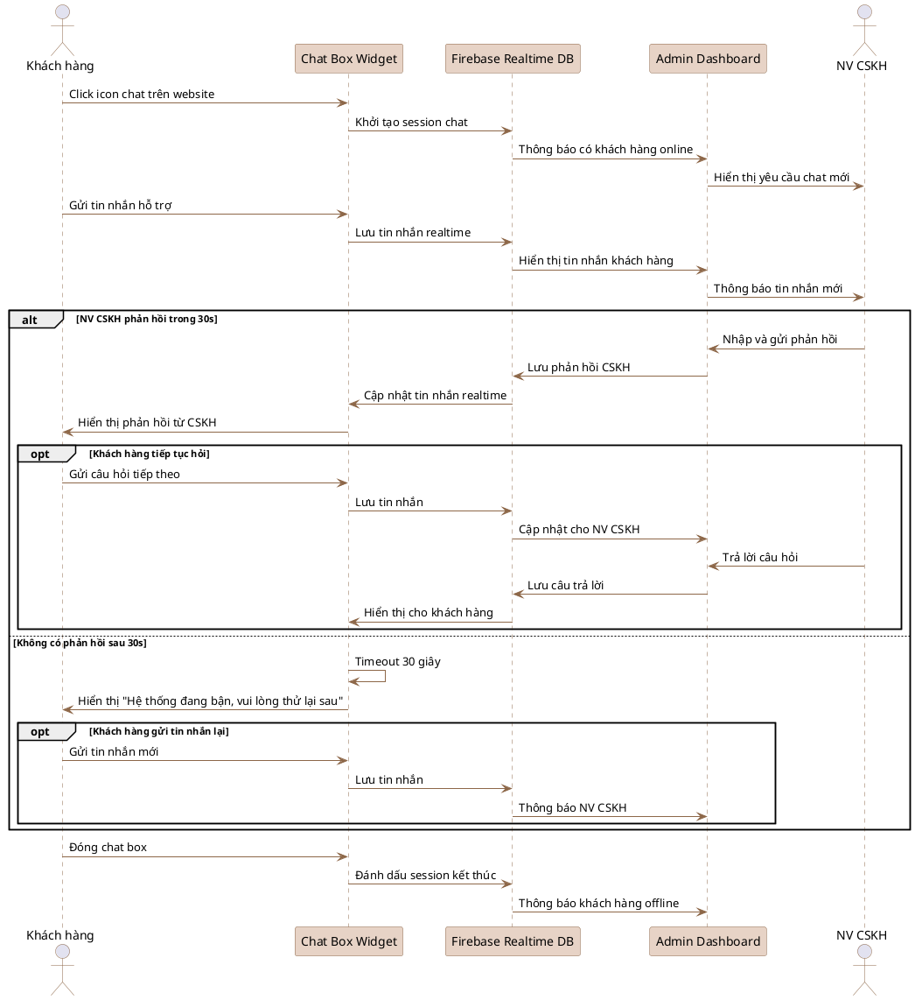
- **Lưu ý:** Sử dụng [PlantUML](https://plantuml.com/sequence-diagram) để render sơ đồ này.

---

## Sequence Diagram UC018: Đăng bài mạng xã hội

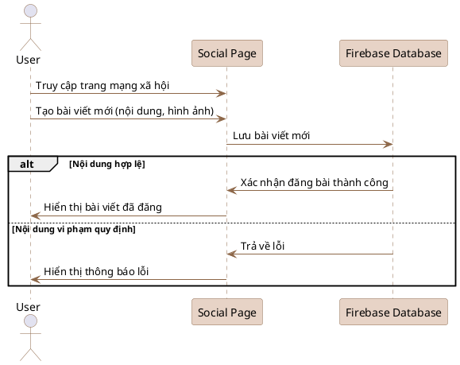
- **Lưu ý:** Sử dụng [PlantUML](https://plantuml.com/sequence-diagram) để render sơ đồ này.

---

## Sequence Diagram UC019: Tương tác bài viết MXH

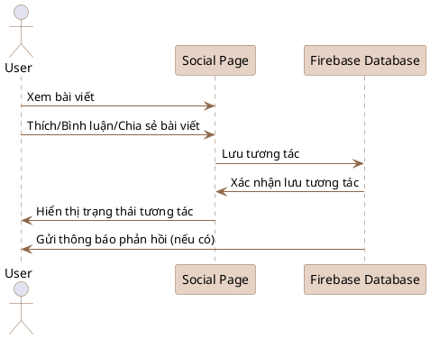
- **Lưu ý:** Sử dụng [PlantUML](https://plantuml.com/sequence-diagram) để render sơ đồ này.

---

## Sequence Diagram UC020: Kết bạn MXH

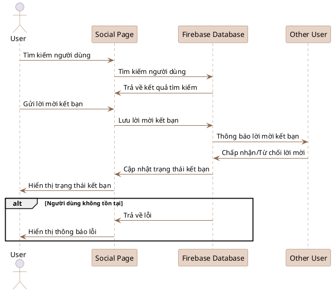
- **Lưu ý:** Sử dụng [PlantUML](https://plantuml.com/sequence-diagram) để render sơ đồ này.

---

## Sequence Diagram UC021: Voice/Video call

```plantuml
@startuml
' Trang trí màu nâu chủ đạo, không dùng nền tổng thể
skinparam sequence {
    ArrowColor #8d6748
    ActorBorderColor #8d6748
    LifeLineBorderColor #8d6748
    LifeLineBackgroundColor #e7d3c6
    ParticipantBorderColor #8d6748
    ParticipantBackgroundColor #e7d3c6
    BoxBorderColor #8d6748
    BoxBackgroundColor #f5eee6
    NoteBackgroundColor #e7d3c6
    NoteBorderColor #8d6748
    AltBackgroundColor #f5eee6
    AltBorderColor #8d6748
}
actor User
participant "Call Page" as CallPage
participant "Other User" as OtherUser
participant "WebRTC" as WebRTC

User -> CallPage: Chọn người gọi
User -> CallPage: Chọn loại cuộc gọi (voice/video)
CallPage -> WebRTC: Thiết lập kết nối WebRTC
WebRTC -> OtherUser: Gửi tín hiệu cuộc gọi
OtherUser -> WebRTC: Chấp nhận cuộc gọi
WebRTC -> CallPage: Thiết lập media stream
User -> CallPage: Thực hiện cuộc gọi
CallPage -> WebRTC: Truyền âm thanh/hình ảnh
User -> CallPage: Kết thúc cuộc gọi
CallPage -> WebRTC: Ngắt kết nối
alt Kết nối mạng không ổn định
    WebRTC -> CallPage: Thông báo lỗi kết nối
    CallPage -> User: Hiển thị thông báo lỗi
end
@enduml
```
- **Lưu ý:** Sử dụng [PlantUML](https://plantuml.com/sequence-diagram) để render sơ đồ này.

---

## Sequence Diagram UC022: Xem dashboard thống kê

```plantuml
@startuml
' Trang trí màu nâu chủ đạo, không dùng nền tổng thể
skinparam sequence {
    ArrowColor #8d6748
    ActorBorderColor #8d6748
    LifeLineBorderColor #8d6748
    LifeLineBackgroundColor #e7d3c6
    ParticipantBorderColor #8d6748
    ParticipantBackgroundColor #e7d3c6
    BoxBorderColor #8d6748
    BoxBackgroundColor #f5eee6
    NoteBackgroundColor #e7d3c6
    NoteBorderColor #8d6748
    AltBackgroundColor #f5eee6
    AltBorderColor #8d6748
}
actor Admin
participant "Dashboard Page" as Dashboard
participant "Firebase Database" as FirebaseDB

Admin -> Dashboard: Truy cập dashboard
Dashboard -> FirebaseDB: Lấy thống kê doanh thu
Dashboard -> FirebaseDB: Lấy thống kê đơn hàng
Dashboard -> FirebaseDB: Lấy thống kê người dùng
Dashboard -> FirebaseDB: Lấy dữ liệu biểu đồ phân tích
FirebaseDB -> Dashboard: Trả về dữ liệu thống kê
Dashboard -> Admin: Hiển thị dashboard tổng quan
@enduml
```
- **Lưu ý:** Sử dụng [PlantUML](https://plantuml.com/sequence-diagram) để render sơ đồ này.

---

## Sequence Diagram UC023: Quản lý người dùng

```plantuml
@startuml
' Trang trí màu nâu chủ đạo, không dùng nền tổng thể
skinparam sequence {
    ArrowColor #8d6748
    ActorBorderColor #8d6748
    LifeLineBorderColor #8d6748
    LifeLineBackgroundColor #e7d3c6
    ParticipantBorderColor #8d6748
    ParticipantBackgroundColor #e7d3c6
    BoxBorderColor #8d6748
    BoxBackgroundColor #f5eee6
    NoteBackgroundColor #e7d3c6
    NoteBorderColor #8d6748
    AltBackgroundColor #f5eee6
    AltBorderColor #8d6748
}
actor Admin
participant "User Management Page" as UserPage
participant "Firebase Database" as FirebaseDB

Admin -> UserPage: Xem danh sách người dùng
UserPage -> FirebaseDB: Lấy danh sách người dùng
FirebaseDB -> UserPage: Trả về danh sách người dùng
Admin -> UserPage: Tìm kiếm/Xem chi tiết/Khóa/Mở khóa/Xóa tài khoản
UserPage -> FirebaseDB: Thực hiện thao tác tương ứng
FirebaseDB -> UserPage: Trả về kết quả thao tác
UserPage -> Admin: Hiển thị kết quả quản lý người dùng
@enduml
```
- **Lưu ý:** Sử dụng [PlantUML](https://plantuml.com/sequence-diagram) để render sơ đồ này.

---

## Sequence Diagram UC024: Quản lý sản phẩm

```plantuml
@startuml
' Trang trí màu nâu chủ đạo, không dùng nền tổng thể
skinparam sequence {
    ArrowColor #8d6748
    ActorBorderColor #8d6748
    LifeLineBorderColor #8d6748
    LifeLineBackgroundColor #e7d3c6
    ParticipantBorderColor #8d6748
    ParticipantBackgroundColor #e7d3c6
    BoxBorderColor #8d6748
    BoxBackgroundColor #f5eee6
    NoteBackgroundColor #e7d3c6
    NoteBorderColor #8d6748
    AltBackgroundColor #f5eee6
    AltBorderColor #8d6748
}
actor Admin
participant "Product Management Page" as ProductPage
participant "Firebase Database" as FirebaseDB
participant "cloudinary" as Cloudinary

Admin -> ProductPage: Xem danh sách sản phẩm
ProductPage -> FirebaseDB: Lấy danh sách sản phẩm
FirebaseDB -> ProductPage: Trả về danh sách sản phẩm
Admin -> ProductPage: Thêm/Sửa/Xóa sản phẩm
alt Thêm/Sửa sản phẩm có upload hình ảnh
    ProductPage -> Cloudinary: Upload hình ảnh sản phẩm
    Cloudinary -> ProductPage: Trả về URL hình ảnh
end
ProductPage -> FirebaseDB: Lưu thông tin sản phẩm
FirebaseDB -> ProductPage: Trả về kết quả thao tác
ProductPage -> Admin: Hiển thị kết quả quản lý sản phẩm
@enduml
```
- **Lưu ý:** Sử dụng [PlantUML](https://plantuml.com/sequence-diagram) để render sơ đồ này.

---

## Sequence Diagram UC025: Quản lý đơn hàng

```plantuml
@startuml
' Trang trí màu nâu chủ đạo, không dùng nền tổng thể
skinparam sequence {
    ArrowColor #8d6748
    ActorBorderColor #8d6748
    LifeLineBorderColor #8d6748
    LifeLineBackgroundColor #e7d3c6
    ParticipantBorderColor #8d6748
    ParticipantBackgroundColor #e7d3c6
    BoxBorderColor #8d6748
    BoxBackgroundColor #f5eee6
    NoteBackgroundColor #e7d3c6
    NoteBorderColor #8d6748
    AltBackgroundColor #f5eee6
    AltBorderColor #8d6748
}
actor Admin
participant "Order Management Page" as OrderPage
participant "Firebase Database" as FirebaseDB

Admin -> OrderPage: Xem danh sách đơn hàng
OrderPage -> FirebaseDB: Lấy danh sách đơn hàng
FirebaseDB -> OrderPage: Trả về danh sách đơn hàng
Admin -> OrderPage: Xem chi tiết/Cập nhật trạng thái/Xác nhận thanh toán/Giao hàng
OrderPage -> FirebaseDB: Thực hiện thao tác tương ứng
FirebaseDB -> OrderPage: Trả về kết quả thao tác
OrderPage -> Admin: Hiển thị kết quả quản lý đơn hàng
@enduml
```
- **Lưu ý:** Sử dụng [PlantUML](https://plantuml.com/sequence-diagram) để render sơ đồ này.

---

## Sequence Diagram UC026: Quản lý mã giảm giá

```plantuml
@startuml
' Trang trí màu nâu chủ đạo, không dùng nền tổng thể
skinparam sequence {
    ArrowColor #8d6748
    ActorBorderColor #8d6748
    LifeLineBorderColor #8d6748
    LifeLineBackgroundColor #e7d3c6
    ParticipantBorderColor #8d6748
    ParticipantBackgroundColor #e7d3c6
    BoxBorderColor #8d6748
    BoxBackgroundColor #f5eee6
    NoteBackgroundColor #e7d3c6
    NoteBorderColor #8d6748
    AltBackgroundColor #f5eee6
    AltBorderColor #8d6748
}
actor Admin
participant "Coupon Management Page" as CouponPage
participant "Firebase Database" as FirebaseDB

Admin -> CouponPage: Xem danh sách mã giảm giá
CouponPage -> FirebaseDB: Lấy danh sách mã giảm giá
FirebaseDB -> CouponPage: Trả về danh sách mã giảm giá
Admin -> CouponPage: Tạo/Sửa/Xóa mã giảm giá
CouponPage -> FirebaseDB: Thực hiện thao tác tương ứng
FirebaseDB -> CouponPage: Trả về kết quả thao tác
CouponPage -> Admin: Hiển thị kết quả quản lý mã giảm giá
@enduml
```
- **Lưu ý:** Sử dụng [PlantUML](https://plantuml.com/sequence-diagram) để render sơ đồ này.

---
## Sequence Diagram UC027: Quản lý tin nhắn & đánh giá

```plantuml
@startuml
skinparam sequence {
    ArrowColor #8d6748
    ActorBorderColor #8d6748
    LifeLineBorderColor #8d6748
    LifeLineBackgroundColor #e7d3c6
    ParticipantBorderColor #8d6748
    ParticipantBackgroundColor #e7d3c6
    BoxBorderColor #8d6748
    BoxBackgroundColor #f5eee6
    NoteBackgroundColor #e7d3c6
    NoteBorderColor #8d6748
    AltBackgroundColor #f5eee6
    AltBorderColor #8d6748
}
actor Admin
actor User
participant "Message & Review Management Page" as MsgReviewPage
participant "Firebase Database" as FirebaseDB

== Quản lý tin nhắn ==
User -> MsgReviewPage: Gửi/Xem tin nhắn
MsgReviewPage -> FirebaseDB: Lưu/Lấy tin nhắn (real-time)
FirebaseDB -> MsgReviewPage: Đẩy/Trả về tin nhắn mới
MsgReviewPage -> User: Hiển thị tin nhắn
Admin -> MsgReviewPage: Xem/Xóa tin nhắn
MsgReviewPage -> FirebaseDB: Lấy/Xóa tin nhắn
FirebaseDB -> MsgReviewPage: Trả về kết quả
MsgReviewPage -> Admin: Hiển thị kết quả

== Quản lý đánh giá ==
User -> MsgReviewPage: Gửi/Xem đánh giá
MsgReviewPage -> FirebaseDB: Lưu/Lấy đánh giá
FirebaseDB -> MsgReviewPage: Trả về danh sách/đánh giá mới
MsgReviewPage -> User: Hiển thị đánh giá
Admin -> MsgReviewPage: Xem/Xóa/Sửa đánh giá
MsgReviewPage -> FirebaseDB: Lấy/Xóa/Sửa đánh giá
FirebaseDB -> MsgReviewPage: Trả về kết quả
MsgReviewPage -> Admin: Hiển thị kết quả
@enduml
```

- **Lưu ý:** Sử dụng [PlantUML](https://plantuml.com/sequence-diagram) để render sơ đồ này.


## Sequence Diagram UC028: Quản lý bài đăng mạng xã hội

```plantuml
@startuml
skinparam sequence {
    ArrowColor #8d6748
    ActorBorderColor #8d6748
    LifeLineBorderColor #8d6748
    LifeLineBackgroundColor #e7d3c6
    ParticipantBorderColor #8d6748
    ParticipantBackgroundColor #e7d3c6
    BoxBorderColor #8d6748
    BoxBackgroundColor #f5eee6
    NoteBackgroundColor #e7d3c6
    NoteBorderColor #8d6748
    AltBackgroundColor #f5eee6
    AltBorderColor #8d6748
}
actor Admin
participant "Social Post Management Page" as SocialPostPage
participant "Firebase Database" as FirebaseDB

Admin -> SocialPostPage: Xem danh sách bài đăng
SocialPostPage -> FirebaseDB: Lấy danh sách bài đăng
FirebaseDB -> SocialPostPage: Trả về danh sách bài đăng
Admin -> SocialPostPage: Xóa bài đăng, bình luận
SocialPostPage -> FirebaseDB: Thực hiện thao tác tương ứng
FirebaseDB -> SocialPostPage: Trả về kết quả thao tác
SocialPostPage -> Admin: Hiển thị kết quả quản lý bài đăng
@enduml
```
- **Lưu ý:** Sử dụng [PlantUML](https://plantuml.com/sequence-diagram) để render sơ đồ này.

---

## Sequence Diagram UC027: Xuất báo cáo thống kê

```plantuml
@startuml
skinparam sequence {
    ArrowColor #8d6748
    ActorBorderColor #8d6748
    LifeLineBorderColor #8d6748
    LifeLineBackgroundColor #e7d3c6
    ParticipantBorderColor #8d6748
    ParticipantBackgroundColor #e7d3c6
    BoxBorderColor #8d6748
    BoxBackgroundColor #f5eee6
    NoteBackgroundColor #e7d3c6
    NoteBorderColor #8d6748
    AltBackgroundColor #f5eee6
    AltBorderColor #8d6748
}
actor Admin
participant "24h News Management Page" as News24hPage
participant "Firebase Database" as FirebaseDB

Admin -> News24hPage: Xem danh sách tin 24h
News24hPage -> FirebaseDB: Lấy danh sách tin 24h
FirebaseDB -> News24hPage: Trả về danh sách tin 24h
Admin -> News24hPage: Xem/Xóa tin 24h
News24hPage -> FirebaseDB: Thực hiện thao tác tương ứng
FirebaseDB -> News24hPage: Trả về kết quả thao tác
News24hPage -> Admin: Hiển thị kết quả quản lý tin 24h
@enduml
```
- **Lưu ý:** Sử dụng [PlantUML](https://plantuml.com/sequence-diagram) để render sơ đồ này.

---


## Sequence Diagram UC027: Xuất báo cáo thống kê

```plantuml
@startuml
' Trang trí màu nâu chủ đạo, không dùng nền tổng thể
skinparam sequence {
    ArrowColor #8d6748
    ActorBorderColor #8d6748
    LifeLineBorderColor #8d6748
    LifeLineBackgroundColor #e7d3c6
    ParticipantBorderColor #8d6748
    ParticipantBackgroundColor #e7d3c6
    BoxBorderColor #8d6748
    BoxBackgroundColor #f5eee6
    NoteBackgroundColor #e7d3c6
    NoteBorderColor #8d6748
    AltBackgroundColor #f5eee6
    AltBorderColor #8d6748
}
actor Admin
participant "Report Page" as ReportPage
participant "Firebase Database" as FirebaseDB

Admin -> ReportPage: Chọn loại báo cáo, khoảng thời gian, định dạng xuất
ReportPage -> FirebaseDB: Lấy dữ liệu báo cáo
FirebaseDB -> ReportPage: Trả về dữ liệu báo cáo
ReportPage -> Admin: Tạo và tải xuống báo cáo (PDF/Excel)
@enduml
```
- **Lưu ý:** Sử dụng [PlantUML](https://plantuml.com/sequence-diagram) để render sơ đồ này.

---

## Sequence Diagram UC028: Thanh toán VNPay

```plantuml
@startuml
' Trang trí màu nâu chủ đạo, không dùng nền tổng thể
skinparam sequence {
    ArrowColor #8d6748
    ActorBorderColor #8d6748
    LifeLineBorderColor #8d6748
    LifeLineBackgroundColor #e7d3c6
    ParticipantBorderColor #8d6748
    ParticipantBackgroundColor #e7d3c6
    BoxBorderColor #8d6748
    BoxBackgroundColor #f5eee6
    NoteBackgroundColor #e7d3c6
    NoteBorderColor #8d6748
    AltBackgroundColor #f5eee6
    AltBorderColor #8d6748
}
actor User
participant "Checkout Page" as Checkout
participant "VNPay Gateway" as VNPay
participant "Order Page" as OrderPage

User -> Checkout: Chọn thanh toán qua VNPay
Checkout -> VNPay: Chuyển hướng đến cổng VNPay
User -> VNPay: Nhập thông tin thẻ
VNPay -> VNPay: Xác thực thanh toán
alt Thanh toán thành công
    VNPay -> Checkout: Trả về kết quả thành công
    Checkout -> OrderPage: Tạo đơn hàng
    OrderPage -> User: Hiển thị xác nhận đơn hàng
else Thanh toán thất bại
    VNPay -> Checkout: Trả về lỗi
    Checkout -> User: Hiển thị thông báo lỗi
end
@enduml
```
- **Lưu ý:** Sử dụng [PlantUML](https://plantuml.com/sequence-diagram) để render sơ đồ này.

---

## Sequence Diagram UC029: Tích hợp AI Chat

```plantuml
@startuml
' Trang trí màu nâu chủ đạo, không dùng nền tổng thể
skinparam sequence {
    ArrowColor #8d6748
    ActorBorderColor #8d6748
    LifeLineBorderColor #8d6748
    LifeLineBackgroundColor #e7d3c6
    ParticipantBorderColor #8d6748
    ParticipantBackgroundColor #e7d3c6
    BoxBorderColor #8d6748
    BoxBackgroundColor #f5eee6
    NoteBackgroundColor #e7d3c6
    NoteBorderColor #8d6748
    AltBackgroundColor #f5eee6
    AltBorderColor #8d6748
}
actor User
participant "AI Chat Page" as AIChat
participant "tudongchat.com" as TudongChat

User -> AIChat: Mở chat AI
AIChat -> TudongChat: Kết nối dịch vụ AI
User -> AIChat: Gửi câu hỏi
AIChat -> TudongChat: Gửi câu hỏi
alt Dịch vụ AI khả dụng
    TudongChat -> AIChat: Nhận phản hồi từ AI
    AIChat -> User: Hiển thị phản hồi
else Dịch vụ AI không khả dụng
    TudongChat -> AIChat: Trả về lỗi
    AIChat -> User: Hiển thị thông báo lỗi
end
@enduml
```
- **Lưu ý:** Sử dụng [PlantUML](https://plantuml.com/sequence-diagram) để render sơ đồ này.

---

## Sequence Diagram UC030: WebRTC Communication

```plantuml
@startuml
' Trang trí màu nâu chủ đạo, không dùng nền tổng thể
skinparam sequence {
    ArrowColor #8d6748
    ActorBorderColor #8d6748
    LifeLineBorderColor #8d6748
    LifeLineBackgroundColor #e7d3c6
    ParticipantBorderColor #8d6748
    ParticipantBackgroundColor #e7d3c6
    BoxBorderColor #8d6748
    BoxBackgroundColor #f5eee6
    NoteBackgroundColor #e7d3c6
    NoteBorderColor #8d6748
    AltBackgroundColor #f5eee6
    AltBorderColor #8d6748
}
actor User
participant "WebRTC Page" as WebRTCPage
participant "WebRTC" as WebRTC
participant "Other User" as OtherUser

User -> WebRTCPage: Khởi tạo kết nối WebRTC
WebRTCPage -> WebRTC: Thiết lập media stream
WebRTC -> OtherUser: Thực hiện cuộc gọi
WebRTC <-> WebRTCPage: Xử lý tín hiệu âm thanh/hình ảnh
User -> WebRTCPage: Kết thúc cuộc gọi
WebRTCPage -> WebRTC: Ngắt kết nối
alt Thiết bị không hỗ trợ/mạng không ổn định
    WebRTC -> WebRTCPage: Thông báo lỗi
    WebRTCPage -> User: Hiển thị thông báo lỗi
end
@enduml
```
- **Lưu ý:** Sử dụng [PlantUML](https://plantuml.com/sequence-diagram) để render sơ đồ này.

# Sequence Diagrams cho Use Cases quản lý nhân sự

## Sequence Diagram UC031: Quản lý chức vụ

```plantuml
@startuml
' Trang trí màu nâu chủ đạo, không dùng nền tổng thể
skinparam sequence {
    ArrowColor #8d6748
    ActorBorderColor #8d6748
    LifeLineBorderColor #8d6748
    LifeLineBackgroundColor #e7d3c6
    ParticipantBorderColor #8d6748
    ParticipantBackgroundColor #e7d3c6
    BoxBorderColor #8d6748
    BoxBackgroundColor #f5eee6
    NoteBackgroundColor #e7d3c6
    NoteBorderColor #8d6748
    AltBackgroundColor #f5eee6
    AltBorderColor #8d6748
}
actor Admin
participant "Position Management Page" as PositionPage
participant "Firebase Database" as FirebaseDB

Admin -> PositionPage: Xem danh sách chức vụ
PositionPage -> FirebaseDB: Lấy danh sách chức vụ
FirebaseDB -> PositionPage: Trả về danh sách chức vụ
Admin -> PositionPage: Thêm/Sửa/Xóa chức vụ
PositionPage -> FirebaseDB: Thực hiện thao tác tương ứng
FirebaseDB -> PositionPage: Trả về kết quả thao tác
PositionPage -> Admin: Hiển thị kết quả quản lý chức vụ
@enduml
```
- **Lưu ý:** Sử dụng [PlantUML](https://plantuml.com/sequence-diagram) để render sơ đồ này.

---

## Sequence Diagram UC032: Quản lý nhân viên

```plantuml
@startuml
' Trang trí màu nâu chủ đạo, không dùng nền tổng thể
skinparam sequence {
    ArrowColor #8d6748
    ActorBorderColor #8d6748
    LifeLineBorderColor #8d6748
    LifeLineBackgroundColor #e7d3c6
    ParticipantBorderColor #8d6748
    ParticipantBackgroundColor #e7d3c6
    BoxBorderColor #8d6748
    BoxBackgroundColor #f5eee6
    NoteBackgroundColor #e7d3c6
    NoteBorderColor #8d6748
    AltBackgroundColor #f5eee6
    AltBorderColor #8d6748
}
actor Admin
participant "Staff Management Page" as StaffPage
participant "Firebase Database" as FirebaseDB
participant "Cloudinary" as Cloudinary

Admin -> StaffPage: Xem danh sách nhân viên
StaffPage -> FirebaseDB: Lấy danh sách nhân viên
FirebaseDB -> StaffPage: Trả về danh sách nhân viên
Admin -> StaffPage: Thêm/Sửa/Xóa thông tin nhân viên
alt Thêm/Sửa nhân viên có upload ảnh
    StaffPage -> Cloudinary: Upload ảnh nhân viên
    Cloudinary -> StaffPage: Trả về URL ảnh
end
StaffPage -> FirebaseDB: Lưu thông tin nhân viên
FirebaseDB -> StaffPage: Trả về kết quả thao tác
StaffPage -> Admin: Hiển thị kết quả quản lý nhân viên
@enduml
```
- **Lưu ý:** Sử dụng [PlantUML](https://plantuml.com/sequence-diagram) để render sơ đồ này.

---

## Sequence Diagram UC033: Quản lý chấm công

```plantuml
@startuml
' Trang trí màu nâu chủ đạo, không dùng nền tổng thể
skinparam sequence {
    ArrowColor #8d6748
    ActorBorderColor #8d6748
    LifeLineBorderColor #8d6748
    LifeLineBackgroundColor #e7d3c6
    ParticipantBorderColor #8d6748
    ParticipantBackgroundColor #e7d3c6
    BoxBorderColor #8d6748
    BoxBackgroundColor #f5eee6
    NoteBackgroundColor #e7d3c6
    NoteBorderColor #8d6748
    AltBackgroundColor #f5eee6
    AltBorderColor #8d6748
}
actor Admin
participant "Timesheet Management Page" as TimesheetPage
participant "Firebase Database" as FirebaseDB
participant "Report Generator" as ReportGen

Admin -> TimesheetPage: Xem bảng chấm công
TimesheetPage -> FirebaseDB: Lấy dữ liệu chấm công
FirebaseDB -> TimesheetPage: Trả về dữ liệu chấm công
Admin -> TimesheetPage: Xác nhận hoặc chỉnh sửa dữ liệu
TimesheetPage -> FirebaseDB: Lưu cập nhật chấm công
FirebaseDB -> TimesheetPage: Xác nhận cập nhật
Admin -> TimesheetPage: Yêu cầu xuất báo cáo chấm công
TimesheetPage -> ReportGen: Tạo báo cáo chấm công
ReportGen -> TimesheetPage: Trả về báo cáo
TimesheetPage -> Admin: Hiển thị/Tải xuống báo cáo
@enduml
```
- **Lưu ý:** Sử dụng [PlantUML](https://plantuml.com/sequence-diagram) để render sơ đồ này.

---

## Sequence Diagram UC034: Xem thông tin cá nhân (Nhân viên)

```plantuml
@startuml
' Trang trí màu nâu chủ đạo, không dùng nền tổng thể
skinparam sequence {
    ArrowColor #8d6748
    ActorBorderColor #8d6748
    LifeLineBorderColor #8d6748
    LifeLineBackgroundColor #e7d3c6
    ParticipantBorderColor #8d6748
    ParticipantBackgroundColor #e7d3c6
    BoxBorderColor #8d6748
    BoxBackgroundColor #f5eee6
    NoteBackgroundColor #e7d3c6
    NoteBorderColor #8d6748
    AltBackgroundColor #f5eee6
    AltBorderColor #8d6748
}
actor Employee
participant "Employee Profile Page" as ProfilePage
participant "Firebase Database" as FirebaseDB

Employee -> ProfilePage: Truy cập trang hồ sơ cá nhân
ProfilePage -> FirebaseDB: Lấy thông tin cá nhân
FirebaseDB -> ProfilePage: Trả về thông tin nhân viên
ProfilePage -> Employee: Hiển thị thông tin cá nhân
@enduml
```
- **Lưu ý:** Sử dụng [PlantUML](https://plantuml.com/sequence-diagram) để render sơ đồ này.

---

## Sequence Diagram UC035: Xem thông tin công việc (Nhân viên)

```plantuml
@startuml
' Trang trí màu nâu chủ đạo, không dùng nền tổng thể
skinparam sequence {
    ArrowColor #8d6748
    ActorBorderColor #8d6748
    LifeLineBorderColor #8d6748
    LifeLineBackgroundColor #e7d3c6
    ParticipantBorderColor #8d6748
    ParticipantBackgroundColor #e7d3c6
    BoxBorderColor #8d6748
    BoxBackgroundColor #f5eee6
    NoteBackgroundColor #e7d3c6
    NoteBorderColor #8d6748
    AltBackgroundColor #f5eee6
    AltBorderColor #8d6748
}
actor Employee
participant "Work Info Page" as WorkPage
participant "Firebase Database" as FirebaseDB

Employee -> WorkPage: Truy cập trang thông tin công việc
WorkPage -> FirebaseDB: Lấy thông tin vị trí, ca làm, lịch làm việc
FirebaseDB -> WorkPage: Trả về thông tin công việc
WorkPage -> Employee: Hiển thị thông tin công việc
@enduml
```
- **Lưu ý:** Sử dụng [PlantUML](https://plantuml.com/sequence-diagram) để render sơ đồ này.

---

## Sequence Diagram UC036: Chấm công vào

```plantuml
@startuml
' Trang trí màu nâu chủ đạo, không dùng nền tổng thể
skinparam sequence {
    ArrowColor #8d6748
    ActorBorderColor #8d6748
    LifeLineBorderColor #8d6748
    LifeLineBackgroundColor #e7d3c6
    ParticipantBorderColor #8d6748
    ParticipantBackgroundColor #e7d3c6
    BoxBorderColor #8d6748
    BoxBackgroundColor #f5eee6
    NoteBackgroundColor #e7d3c6
    NoteBorderColor #8d6748
    AltBackgroundColor #f5eee6
    AltBorderColor #8d6748
}
actor Employee
participant "Timesheet Page" as TimeSheet
participant "Firebase Database" as FirebaseDB

Employee -> TimeSheet: Truy cập chức năng chấm công
Employee -> TimeSheet: Chọn "Chấm công vào"
TimeSheet -> FirebaseDB: Lưu thời gian chấm công vào
FirebaseDB -> TimeSheet: Xác nhận lưu thời gian, kinh độ vĩ độ
TimeSheet -> Employee: Hiển thị xác nhận chấm công vào thành công
@enduml
```
- **Lưu ý:** Sử dụng [PlantUML](https://plantuml.com/sequence-diagram) để render sơ đồ này.

---

## Sequence Diagram UC037: Chấm công ra

```plantuml
@startuml
' Trang trí màu nâu chủ đạo, không dùng nền tổng thể
skinparam sequence {
    ArrowColor #8d6748
    ActorBorderColor #8d6748
    LifeLineBorderColor #8d6748
    LifeLineBackgroundColor #e7d3c6
    ParticipantBorderColor #8d6748
    ParticipantBackgroundColor #e7d3c6
    BoxBorderColor #8d6748
    BoxBackgroundColor #f5eee6
    NoteBackgroundColor #e7d3c6
    NoteBorderColor #8d6748
    AltBackgroundColor #f5eee6
    AltBorderColor #8d6748
}
actor Employee
participant "Timesheet Page" as TimeSheet
participant "Firebase Database" as FirebaseDB

Employee -> TimeSheet: Truy cập chức năng chấm công
TimeSheet -> FirebaseDB: Kiểm tra đã chấm công vào
alt Đã chấm công vào
    Employee -> TimeSheet: Chọn "Chấm công ra"
    TimeSheet -> FirebaseDB: Lưu thời gian chấm công ra
    FirebaseDB -> TimeSheet: Xác nhận lưu thời gian, kinh độ, vĩ độ
    TimeSheet -> Employee: Hiển thị xác nhận chấm công ra thành công
else Chưa chấm công vào
    FirebaseDB -> TimeSheet: Trả về thông báo lỗi
    TimeSheet -> Employee: Hiển thị thông báo cần chấm công vào trước
end
@enduml
```
- **Lưu ý:** Sử dụng [PlantUML](https://plantuml.com/sequence-diagram) để render sơ đồ này.

---

## Sequence Diagram UC038: Xin nghỉ phép

```plantuml
@startuml
' Trang trí màu nâu chủ đạo, không dùng nền tổng thể
skinparam sequence {
    ArrowColor #8d6748
    ActorBorderColor #8d6748
    LifeLineBorderColor #8d6748
    LifeLineBackgroundColor #e7d3c6
    ParticipantBorderColor #8d6748
    ParticipantBackgroundColor #e7d3c6
    BoxBorderColor #8d6748
    BoxBackgroundColor #f5eee6
    NoteBackgroundColor #e7d3c6
    NoteBorderColor #8d6748
    AltBackgroundColor #f5eee6
    AltBorderColor #8d6748
}
actor Employee
participant "Leave Request Page" as LeavePage
participant "Firebase Database" as FirebaseDB
participant "Admin" as Admin

Employee -> LeavePage: Truy cập chức năng xin nghỉ phép
Employee -> LeavePage: Nhập thông tin ngày nghỉ, lý do
LeavePage -> FirebaseDB: Lưu yêu cầu nghỉ phép
FirebaseDB -> Admin: Gửi thông báo yêu cầu mới
Admin -> FirebaseDB: Duyệt/Từ chối yêu cầu
FirebaseDB -> LeavePage: Cập nhật trạng thái yêu cầu
LeavePage -> Employee: Hiển thị kết quả xử lý yêu cầu
@enduml
```
- **Lưu ý:** Sử dụng [PlantUML](https://plantuml.com/sequence-diagram) để render sơ đồ này.

---

## Sequence Diagram UC039: Thêm tăng ca

```plantuml
@startuml
' Trang trí màu nâu chủ đạo, không dùng nền tổng thể
skinparam sequence {
    ArrowColor #8d6748
    ActorBorderColor #8d6748
    LifeLineBorderColor #8d6748
    LifeLineBackgroundColor #e7d3c6
    ParticipantBorderColor #8d6748
    ParticipantBackgroundColor #e7d3c6
    BoxBorderColor #8d6748
    BoxBackgroundColor #f5eee6
    NoteBackgroundColor #e7d3c6
    NoteBorderColor #8d6748
    AltBackgroundColor #f5eee6
    AltBorderColor #8d6748
}
actor Employee
participant "Overtime Request Page" as OvertimePage
participant "Firebase Database" as FirebaseDB
participant "Admin" as Admin

Employee -> OvertimePage: Truy cập chức năng đăng ký tăng ca
Employee -> OvertimePage: Nhập thông tin ca tăng ca
OvertimePage -> FirebaseDB: Lưu yêu cầu tăng ca
FirebaseDB -> Admin: Gửi thông báo yêu cầu mới
Admin -> FirebaseDB: Duyệt/Từ chối yêu cầu
FirebaseDB -> OvertimePage: Cập nhật trạng thái yêu cầu
OvertimePage -> Employee: Hiển thị kết quả xử lý yêu cầu
@enduml
```
- **Lưu ý:** Sử dụng [PlantUML](https://plantuml.com/sequence-diagram) để render sơ đồ này.

---

## Sequence Diagram UC040: Xem thông báo (Nhân viên)

```plantuml
@startuml
' Trang trí màu nâu chủ đạo, không dùng nền tổng thể
skinparam sequence {
    ArrowColor #8d6748
    ActorBorderColor #8d6748
    LifeLineBorderColor #8d6748
    LifeLineBackgroundColor #e7d3c6
    ParticipantBorderColor #8d6748
    ParticipantBackgroundColor #e7d3c6
    BoxBorderColor #8d6748
    BoxBackgroundColor #f5eee6
    NoteBackgroundColor #e7d3c6
    NoteBorderColor #8d6748
    AltBackgroundColor #f5eee6
    AltBorderColor #8d6748
}
actor Employee
participant "Notification Page" as NotifPage
participant "Firebase Database" as FirebaseDB

Employee -> NotifPage: Truy cập trang thông báo
NotifPage -> FirebaseDB: Lấy danh sách thông báo
FirebaseDB -> NotifPage: Trả về danh sách thông báo
Employee -> NotifPage: Đọc chi tiết thông báo
NotifPage -> FirebaseDB: Cập nhật trạng thái đã đọc
FirebaseDB -> NotifPage: Xác nhận cập nhật
NotifPage -> Employee: Hiển thị chi tiết thông báo
@enduml
```
- **Lưu ý:** Sử dụng [PlantUML](https://plantuml.com/sequence-diagram) để render sơ đồ này.

---

## Sequence Diagram UC041: Xem tình hình nhân sự

```plantuml
@startuml
' Trang trí màu nâu chủ đạo, không dùng nền tổng thể
skinparam sequence {
    ArrowColor #8d6748
    ActorBorderColor #8d6748
    LifeLineBorderColor #8d6748
    LifeLineBackgroundColor #e7d3c6
    ParticipantBorderColor #8d6748
    ParticipantBackgroundColor #e7d3c6
    BoxBorderColor #8d6748
    BoxBackgroundColor #f5eee6
    NoteBackgroundColor #e7d3c6
    NoteBorderColor #8d6748
    AltBackgroundColor #f5eee6
    AltBorderColor #8d6748
}
actor Employee
participant "Staff Overview Page" as StaffPage
participant "Firebase Database" as FirebaseDB

Employee -> StaffPage: Truy cập trang tổng quan nhân sự
StaffPage -> FirebaseDB: Lấy thông tin nhân sự (số lượng, ca làm, vắng mặt)
FirebaseDB -> StaffPage: Trả về dữ liệu tổng hợp
StaffPage -> Employee: Hiển thị thông tin nhân sự tổng quan
@enduml
```
- **Lưu ý:** Sử dụng [PlantUML](https://plantuml.com/sequence-diagram) để render sơ đồ này.

---

## Sequence Diagram UC042: Xem thống kê (Nhân viên)

```plantuml
@startuml
' Trang trí màu nâu chủ đạo, không dùng nền tổng thể
skinparam sequence {
    ArrowColor #8d6748
    ActorBorderColor #8d6748
    LifeLineBorderColor #8d6748
    LifeLineBackgroundColor #e7d3c6
    ParticipantBorderColor #8d6748
    ParticipantBackgroundColor #e7d3c6
    BoxBorderColor #8d6748
    BoxBackgroundColor #f5eee6
    NoteBackgroundColor #e7d3c6
    NoteBorderColor #8d6748
    AltBackgroundColor #f5eee6
    AltBorderColor #8d6748
}
actor Employee
participant "Personal Stats Page" as StatsPage
participant "Firebase Database" as FirebaseDB

Employee -> StatsPage: Truy cập trang thống kê cá nhân
StatsPage -> FirebaseDB: Lấy dữ liệu chấm công, tăng ca, nghỉ phép
FirebaseDB -> StatsPage: Trả về dữ liệu thống kê
StatsPage -> Employee: Hiển thị biểu đồ và số liệu thống kê
@enduml
```
- **Lưu ý:** Sử dụng [PlantUML](https://plantuml.com/sequence-diagram) để render sơ đồ này.
